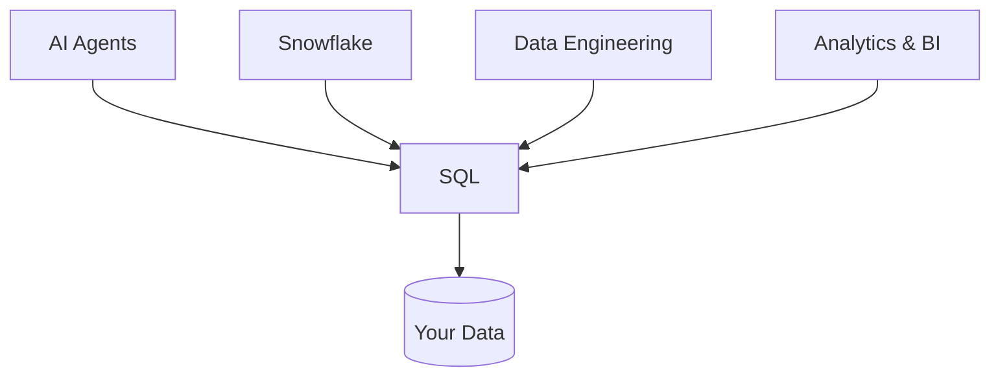

# Before Snowflake, Before AI — There Is SQL

> **Level:** All levels · **Reading time:** 6 minutes

---

## 🎣 The Hook

Everyone wants to skip to the exciting part. They want to build AI agents, design Snowflake warehouses, train models. But here's the secret no bootcamp tells you: **every one of those technologies sits on top of SQL.** Before Snowflake. Before data engineering. Before analytics. Before AI. There is SQL.

---

## 💼 The Business Problem

A company has data — customers, orders, employees, revenue — scattered across systems. The CEO asks a simple question: *"Which products made us the most money last quarter?"*

No AI model can answer that without first **retrieving and aggregating** the data. No dashboard exists without a query behind it. No machine learning model trains without a `SELECT` pulling features. The question that runs every business is, at its core, a SQL query.

---

## 🧠 The Concept

SQL is the **lingua franca of data**. It has survived 50 years and every technology wave because it does one thing perfectly: it lets you *describe what data you want* and lets the machine figure out how to get it.

```sql
-- The CEO's question, answered
SELECT 
    p.category,
    SUM(st.revenue) AS revenue
FROM sales_transactions st
JOIN products p ON st.product_id = p.product_id
WHERE st.fiscal_quarter = 4 AND st.fiscal_year = 2024
GROUP BY p.category
ORDER BY revenue DESC;
```

That's it. That query is more valuable to a business than most ML models, because it directly answers the question that drives a decision.

---

## 🏗️ Why It Sits Under Everything



- **Analytics** is SQL aggregations behind a chart.
- **Data engineering** is SQL transformations in a pipeline.
- **Snowflake** is SQL on cloud-scale compute.
- **AI** retrieves its facts with SQL (RAG, Text-to-SQL, feature stores).

Learn SQL deeply and you've learned the foundation of all of it.

---

## 🔬 A Concrete Example

Watch the same skill scale across roles:

```sql
-- Analyst: monthly revenue
SELECT DATE_TRUNC('month', sale_date) AS month, SUM(revenue)
FROM sales_transactions GROUP BY 1;

-- Engineer: same logic, now a pipeline transformation feeding a warehouse
-- Architect: same logic, now a fact table in a star schema
-- AI: same logic, now a tool an agent calls to answer "how's revenue trending?"
```

One skill. Every level.

---

## 🏋️ Try It Yourself

1. Write a query to count active employees by department.
2. Find your top 5 customers by lifetime value.
3. Calculate total revenue by month for 2024.

(All using the DataVerse datasets in this repo — start with [MISSION 1](../MISSIONS/MISSION-01/README.md).)

---

## 🔗 References

- [DataVerse datasets](../DATASETS/README.md)
- [Mission 1: Your First SELECT](../MISSIONS/MISSION-01/README.md)
- [The full career roadmap](../ROADMAP.md)

---

## 📣 LinkedIn Summary

> Everyone wants to build AI agents and Snowflake pipelines. But here's what no bootcamp tells you: every one of those technologies runs on SQL. Before Snowflake, before data engineering, before AI — there is SQL. I wrote about why mastering it is the highest-leverage skill in data. 🧵

**SEO keywords:** learn SQL, SQL for data engineering, SQL for AI, why learn SQL, SQL fundamentals, PostgreSQL tutorial, data career
