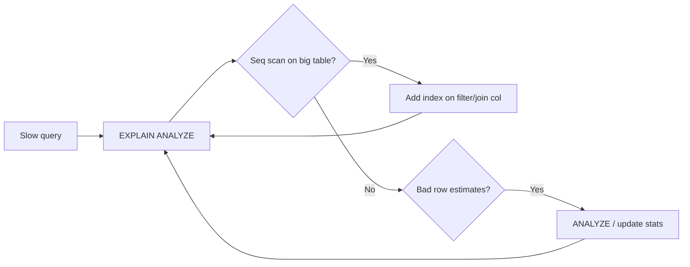

# EXPLAIN: Reading the Database's Mind

> **Level:** L4 (Data Engineer) · **Reading time:** 7 minutes

---

## 🎣 The Hook

When a query is slow, juniors guess. Seniors run `EXPLAIN`. It shows you exactly *how* the database plans to execute your query — and once you can read it, optimization stops being guesswork.

---

## 💼 The Business Problem

A pipeline query is timing out in production. The team is randomly adding indexes hoping something sticks. The right move: ask the database what it's actually doing.

---

## 🧠 The Concept

`EXPLAIN` shows the query plan; `EXPLAIN ANALYZE` actually runs it and reports real timing:

```sql
EXPLAIN ANALYZE
SELECT c.company_name, SUM(st.revenue)
FROM customers c
JOIN orders o ON c.customer_id = o.customer_id
JOIN sales_transactions st ON o.order_id = st.order_id
GROUP BY c.company_name;
```

### What to Look For

```
Seq Scan on orders        ← reading the whole table (red flag on big tables)
Index Scan using idx_...   ← using an index (good)
Hash Join / Nested Loop    ← how tables are combined
Rows Removed by Filter     ← work wasted on rows you didn't need
actual time=... rows=...    ← real cost (with ANALYZE)
```

### Reading a Plan

Plans are trees — read inner/indented nodes first. The biggest `actual time` is your bottleneck. A **Seq Scan** on a large table in a selective query usually means a missing index.

```sql
EXPLAIN (ANALYZE, BUFFERS)
SELECT * FROM orders WHERE customer_id = 5;
-- BUFFERS shows cache hits vs disk reads — reveals I/O cost
```

---

## 🛠️ The Optimization Loop



---

## ⚠️ Common Findings

- **Seq Scan + WHERE on big table** → add an index.
- **Wrong row estimates** → run `ANALYZE` to refresh statistics.
- **Nested Loop on large sets** → may need an index so the planner picks Hash Join.
- **Rows Removed by Filter (huge)** → you're scanning then discarding; filter earlier or index.

---

## 🏋️ Try It Yourself

1. Run `EXPLAIN ANALYZE` on a join query; identify the slowest node.
2. Add an index and re-run; compare the plan.
3. Run `ANALYZE` on a table and observe estimate changes.

→ Practice in [MISSION 9](../MISSIONS/MISSION-09/README.md).

---

## 🔗 References

- [Mission 9: Database Performance Crisis](../MISSIONS/MISSION-09/README.md)

---

## 📣 LinkedIn Summary

> When a query is slow, juniors guess and seniors run EXPLAIN. It shows exactly how the database plans to execute your query — seq scans, joins, row estimates, real timing. Once you can read a query plan, optimization stops being guesswork. Here's how. 🧵

**SEO keywords:** SQL EXPLAIN, EXPLAIN ANALYZE, query plan, query optimization, sequential scan, PostgreSQL performance, database tuning
