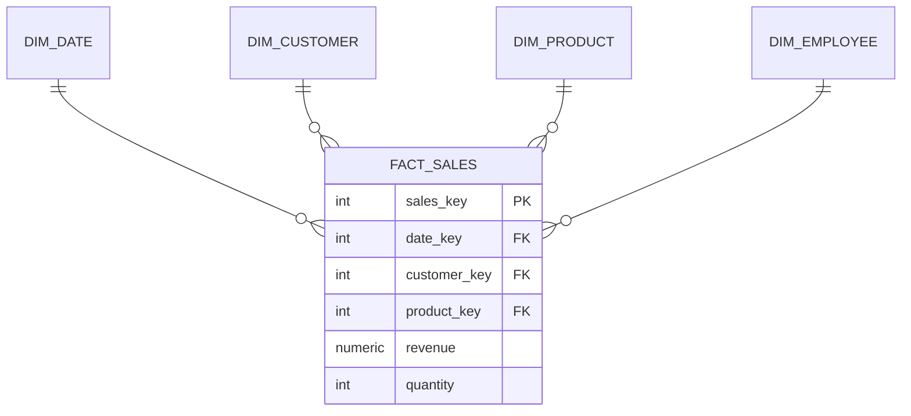

# Star Schemas: How Warehouses Really Work

> **Level:** L7 (Data Architect) · **Reading time:** 9 minutes

---

## 🎣 The Hook

Your analysts are joining 8 tables for every report. It's slow, error-prone, and nobody remembers which join is correct. There's a better way that the entire BI industry standardized on decades ago: the **star schema**.

---

## 💼 The Business Problem

DataVerse's analytics are a mess. Every dashboard reinvents the same complex joins. The CTO and CDO want a single, fast, intuitive analytics foundation. The answer is dimensional modeling.

---

## 🧠 The Concept

A star schema has one central **fact table** (the measurements) surrounded by **dimension tables** (the descriptive context).



- **Fact table** — numeric, additive measures (revenue, quantity). Millions of rows.
- **Dimensions** — who/what/when/where (customer, product, date). Few rows, rich attributes.

---

## 🔑 Surrogate Keys

Dimensions use a system-generated **surrogate key** instead of the business key:

```sql
CREATE TABLE dim_customer (
    customer_key  SERIAL PRIMARY KEY,   -- surrogate (warehouse-only)
    customer_id   INTEGER,              -- natural/business key
    company_name  VARCHAR(200),
    industry      VARCHAR(100),
    segment       VARCHAR(50)
);
```

Why? Stability (business keys change), performance (integers join fast), and history tracking (SCD2).

---

## ⭐ The Payoff: Clean Queries

```sql
-- Revenue by industry and quarter — one clean star join
SELECT dc.industry, dd.year, dd.quarter, SUM(fs.revenue) AS revenue
FROM fact_sales fs
JOIN dim_customer dc ON fs.customer_key = dc.customer_key
JOIN dim_date dd     ON fs.date_key = dd.date_key
GROUP BY dc.industry, dd.year, dd.quarter;
```

Compare that to joining `customers`, `orders`, `order_items`, `sales_transactions`, and deriving dates inline. The star schema is faster *and* easier to reason about.

---

## ❄️ Star vs Snowflake Schema

- **Star** — dimensions are denormalized (one table per dimension). Fewer joins, faster.
- **Snowflake** — dimensions are normalized into sub-dimensions (e.g. product → category table). More joins, less redundancy.

Most warehouses favor **star** for query performance.

---

## 📅 The Date Dimension

Every warehouse has one — it turns ugly date math into simple joins:

```sql
INSERT INTO dim_date
SELECT TO_CHAR(d,'YYYYMMDD')::INT, d, EXTRACT(YEAR FROM d),
       EXTRACT(QUARTER FROM d), EXTRACT(MONTH FROM d), TO_CHAR(d,'Month'),
       EXTRACT(DOW FROM d) IN (0,6)
FROM generate_series('2022-01-01'::date,'2025-12-31','1 day') d;
```

---

## 🏋️ Try It Yourself

1. Design a `fact_sales` table with surrogate foreign keys.
2. Build a date dimension with `generate_series`.
3. Write the ETL that loads the fact by resolving natural → surrogate keys.

→ Practice in [MISSION 10](../MISSIONS/MISSION-10/README.md) and [PROJECT 05](../PROJECTS/PROJECT-05/README.md).

---

## 🔗 References

- [Mission 10: Data Warehouse Design](../MISSIONS/MISSION-10/README.md)
- [Data Warehouse SQL Cheat Sheet](../CHEATSHEETS/07-data-warehouse-sql.md)

---

## 📣 LinkedIn Summary

> If your analysts join 8 tables for every report, you don't have an analytics problem — you have a modeling problem. The star schema solved this decades ago: one fact table, surrounded by dimensions, with surrogate keys. Here's how data warehouses really work. 🧵

**SEO keywords:** star schema, data warehouse, fact table, dimension table, surrogate key, dimensional modeling, snowflake schema, data architect
