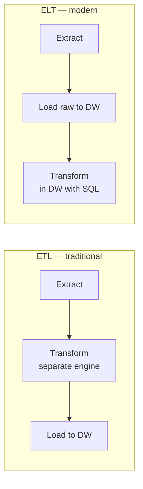

# ETL vs ELT: The Shift That Defined Modern Data

> **Level:** L4 (Data Engineer) · **Reading time:** 7 minutes

---

## 🎣 The Hook

Two acronyms, three letters each, one transposition — and the difference reshaped the entire data industry. The move from **ETL** to **ELT** is the single biggest architectural shift of the modern data stack. If you don't understand it, you don't understand modern data engineering.

---

## 💼 The Business Problem

DataVerse's pipelines were built when compute was expensive: transform data on a separate server, then load the cleaned result. But now they run on cheap cloud warehouses. The Head of Data Engineering asks: *"Are we doing this the modern way, or are we burning money on legacy patterns?"*

---

## 🧠 The Concept



- **ETL** (Extract → Transform → Load): transform *before* loading. Born when storage/compute were costly, so you only loaded clean data.
- **ELT** (Extract → Load → Transform): load raw data first, transform *inside* the warehouse using SQL. Born from cheap, elastic cloud compute.

---

## ⚖️ Why ELT Won

| | ETL | ELT |
|--|-----|-----|
| Transform location | Separate engine | In the warehouse |
| Speed to first load | Slower | Fast (load raw) |
| Flexibility | Schema fixed upfront | Re-transform anytime |
| Raw data kept? | Often discarded | Always retained |
| Modern tooling | Legacy ETL tools | Fivetran/Airbyte + dbt |

The killer advantage: with ELT you keep the **raw data**. If requirements change, you re-transform — no re-extraction needed. And transformations are just SQL, version-controlled in dbt.

---

## 🔬 ELT in Practice

```sql
-- LOAD: raw lands as-is (Fivetran/Airbyte does this)
-- TRANSFORM: this is just SQL in the warehouse (dbt model)

CREATE TABLE silver_orders AS
SELECT 
    order_id,
    customer_id,
    UPPER(TRIM(order_status)) AS order_status,
    COALESCE(discount_pct, 0) AS discount_pct
FROM raw_orders
WHERE order_date IS NOT NULL;
```

That `SELECT` *is* the "T" in ELT. Your SQL skills are the substance of modern transformation.

---

## 🏗️ The Modern Stack

```
Source → Fivetran/Airbyte (EL) → Snowflake/BigQuery → dbt (T) → BI/AI
```

Every "T" is SQL. This is why SQL is more valuable than ever.

---

## 🏋️ Try It Yourself

1. Write a transformation that cleans raw order data (standardize, handle NULLs).
2. Explain when ETL still makes sense (hint: regulatory pre-load masking).
3. Build a 3-step ELT: load raw → clean → aggregate.

→ Practice in [MISSION 12](../MISSIONS/MISSION-12/README.md).

---

## 🔗 References

- [Mission 12: Data Engineering Pipelines](../MISSIONS/MISSION-12/README.md)

---

## 📣 LinkedIn Summary

> ETL → ELT. Transpose two letters and you've described the biggest shift in modern data engineering. Cheap cloud compute flipped the model: load raw first, transform in the warehouse with SQL. Here's why ELT won — and why it makes SQL more valuable than ever. 🧵

**SEO keywords:** ETL vs ELT, modern data stack, data engineering, dbt, data pipeline, ELT explained, cloud data warehouse, data transformation
