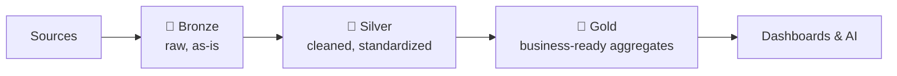

# The Medallion Architecture in Plain SQL

> **Level:** L4 (Data Engineer) · **Reading time:** 7 minutes

---

## 🎣 The Hook

Bronze. Silver. Gold. It sounds like an Olympic podium, but it's actually the cleanest mental model in data engineering for organizing how raw data becomes business-ready insight. And it's all just SQL transformations stacked in layers.

---

## 💼 The Business Problem

DataVerse dumps raw data from a dozen sources into the warehouse. It's messy: inconsistent casing, NULLs, duplicates. Analysts build reports directly on this chaos and get different numbers every time. The fix: a layered architecture with clear quality gates.

---

## 🧠 The Concept



Each layer has a single, clear job — and each transition is a SQL `SELECT`.

### 🥉 Bronze — Raw Landing

Load exactly what the source gives you. No transformation. This is your source of truth and your replay buffer.

```sql
CREATE TABLE bronze_orders AS SELECT * FROM source_orders;
```

### 🥈 Silver — Cleaned & Conformed

Standardize, deduplicate, handle NULLs, enforce types.

```sql
CREATE TABLE silver_orders AS
SELECT 
    order_id,
    customer_id,
    UPPER(TRIM(order_status))   AS order_status,
    COALESCE(discount_pct, 0)   AS discount_pct,
    order_date
FROM bronze_orders
WHERE order_date IS NOT NULL
  AND customer_id IS NOT NULL;
```

### 🥇 Gold — Business-Ready

Aggregate into the metrics stakeholders actually consume.

```sql
CREATE TABLE gold_daily_revenue AS
SELECT 
    o.order_date,
    COUNT(DISTINCT o.order_id) AS orders,
    SUM(oi.line_total)         AS revenue
FROM silver_orders o
JOIN order_items oi ON o.order_id = oi.order_id
WHERE o.order_status = 'DELIVERED'
GROUP BY o.order_date;
```

---

## ✅ Why This Works

- **Debuggability** — when a number looks wrong, you trace it layer by layer.
- **Reusability** — many Gold tables build on the same Silver foundation.
- **Replayability** — Bronze keeps raw data so you can re-transform anytime.
- **Trust** — analysts build on Gold, not raw chaos, so numbers match.

This is exactly how dbt projects are organized (staging → intermediate → marts).

---

## 🏋️ Try It Yourself

1. Build a Silver table cleaning the `customers` raw data.
2. Build a Gold table: monthly revenue by industry.
3. Add a comment explaining each layer's responsibility.

→ Practice in [MISSION 12](../MISSIONS/MISSION-12/README.md).

---

## 🔗 References

- [Mission 12: Data Engineering Pipelines](../MISSIONS/MISSION-12/README.md)

---

## 📣 LinkedIn Summary

> Bronze → Silver → Gold. It sounds like a podium, but it's the cleanest mental model in data engineering: raw → cleaned → business-ready, each transition just a SQL SELECT. Here's the medallion architecture explained in plain SQL. 🥉🥈🥇

**SEO keywords:** medallion architecture, bronze silver gold, data engineering, dbt, ELT, data pipeline layers, data quality, lakehouse
