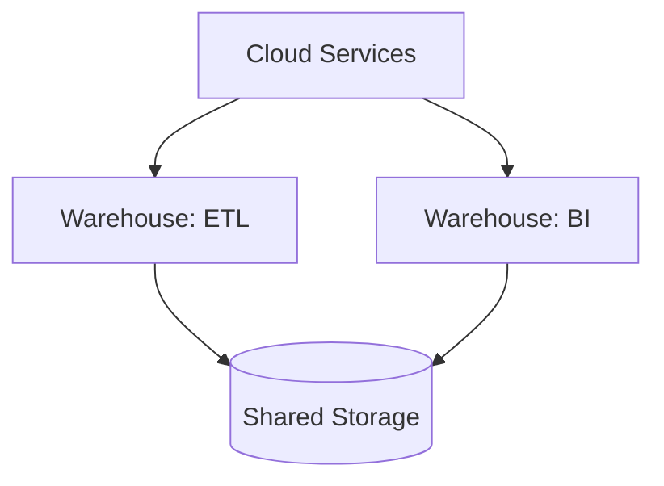

# Snowflake for PostgreSQL People

> **Level:** L6 (Snowflake Developer) · **Reading time:** 8 minutes

---

## 🎣 The Hook

You know PostgreSQL. Your company is moving to Snowflake. Panic? No. Here's the liberating truth: **90% of your SQL transfers unchanged.** Snowflake isn't a new language to learn — it's a new engine that runs the SQL you already know, plus a few superpowers.

---

## 💼 The Business Problem

DataVerse's board approved a cloud migration from PostgreSQL to Snowflake. The CTO needs the team productive fast: *"What actually changes, and what stays the same?"*

---

## 🧠 The Concept: What Stays the Same

Snowflake uses ANSI SQL. All of this works identically:

```sql
-- These run unchanged in both PostgreSQL and Snowflake:
SELECT, FROM, WHERE, GROUP BY, HAVING, ORDER BY, LIMIT
INNER/LEFT/RIGHT/FULL JOIN
CTEs, recursive CTEs
Window functions (ROW_NUMBER, RANK, LAG, LEAD, SUM OVER...)
CASE, COALESCE, NULLIF
UNION, INTERSECT, EXCEPT
ILIKE, string concatenation with ||
```

If you can write analytics SQL in Postgres, you can write it in Snowflake today.

---

## 🔄 What Changes

### Architecture: Storage ≠ Compute



Compute (virtual warehouses) is separate from storage. Multiple teams query the same data without competing for resources.

```sql
CREATE WAREHOUSE bi_wh WAREHOUSE_SIZE='MEDIUM' AUTO_SUSPEND=60 AUTO_RESUME=TRUE;
```

### DDL Differences

| PostgreSQL | Snowflake |
|------------|-----------|
| `SERIAL` | `AUTOINCREMENT` |
| `TEXT` | `VARCHAR` (no length penalty) |
| `JSONB` | `VARIANT` |
| `CREATE INDEX` | *(none — automatic)* |
| `PARTITION BY` | `CLUSTER BY` (optional) |
| `VACUUM`/`ANALYZE` | *(automatic)* |

### What You Stop Doing

No more index tuning, vacuuming, or partition management. Snowflake handles storage optimization automatically via micro-partitions. This is genuinely less work.

---

## ✨ The Superpowers

```sql
-- Time Travel: query the past
SELECT * FROM fact_sales AT (OFFSET => -3600);

-- Zero-Copy Clone: instant dev environment, no storage cost
CREATE DATABASE dev CLONE prod;

-- Auto-suspend: stop paying when idle
ALTER WAREHOUSE bi_wh SET AUTO_SUSPEND = 60;
```

These don't exist in vanilla PostgreSQL and they're game-changers for operations and cost.

---

## 🏋️ Try It Yourself

1. Translate a PostgreSQL `CREATE TABLE` to Snowflake DDL.
2. Map five PostgreSQL types to their Snowflake equivalents.
3. Write a virtual warehouse definition with auto-suspend.

→ Practice in [MISSION 11](../MISSIONS/MISSION-11/README.md) and [PROJECT 06](../PROJECTS/PROJECT-06/README.md).

---

## 🔗 References

- [Mission 11: Snowflake Migration](../MISSIONS/MISSION-11/README.md)
- [Snowflake SQL Mapping Cheat Sheet](../CHEATSHEETS/08-snowflake-sql-mapping.md)

---

## 📣 LinkedIn Summary

> Moving from PostgreSQL to Snowflake? Don't panic. 90% of your SQL transfers unchanged — Snowflake isn't a new language, it's a new engine for the SQL you already know. Here's what stays the same, what changes, and the superpowers you gain (Time Travel, cloning, auto-suspend). 🧵

**SEO keywords:** Snowflake, PostgreSQL to Snowflake, Snowflake SQL, cloud data warehouse, virtual warehouse, Snowflake migration, Time Travel, zero-copy clone
