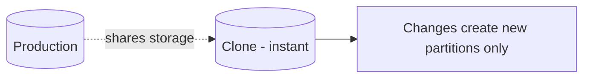

# Time Travel and Zero-Copy Cloning

> **Level:** L6 (Snowflake Developer) · **Reading time:** 6 minutes

---

## 🎣 The Hook

Someone runs `DELETE` without a `WHERE` clause in production. In PostgreSQL, that's a restore-from-backup nightmare. In Snowflake, it's a one-line fix you make in 30 seconds. Two features make this possible: **Time Travel** and **Zero-Copy Cloning** — and they change how you operate forever.

---

## 💼 The Business Problem

DataVerse's engineers are terrified of touching production. Every change risks data loss. Testing requires copying gigabytes into a separate environment that takes hours to provision. There has to be a better way — and Snowflake delivers it.

---

## 🧠 Time Travel

Snowflake retains historical versions of your data, so you can query — or recover — the past.

```sql
-- Query the table as it was 1 hour ago
SELECT * FROM fact_sales AT (OFFSET => -3600);

-- As of a specific moment
SELECT * FROM fact_sales AT (TIMESTAMP => '2024-11-01 09:00:00'::TIMESTAMP);

-- Recover rows deleted by a bad statement
INSERT INTO fact_sales
SELECT * FROM fact_sales BEFORE (STATEMENT => '<the_bad_query_id>');

-- Restore an accidentally dropped table
UNDROP TABLE fact_sales;
```

Default retention is 1 day (up to 90 on Enterprise). That `DELETE` disaster? Recovered. No backup restore, no downtime.

---

## 🧬 Zero-Copy Cloning

Clone a table, schema, or entire database **instantly**, without duplicating storage. The clone shares the original's micro-partitions and only diverges as you make changes.

```sql
-- Clone a table for testing — no storage cost, instant
CREATE TABLE fact_sales_dev CLONE fact_sales;

-- Clone an entire database for a full test environment
CREATE DATABASE analytics_dev CLONE analytics_prod;
```



---

## 💡 Why This Changes Everything

| Old way (PostgreSQL) | Snowflake |
|----------------------|-----------|
| Restore from backup (hours) | `UNDROP` / Time Travel (seconds) |
| Copy GBs for a test env (hours, storage cost) | `CLONE` (instant, free) |
| Fear of production changes | Safe experimentation |

Teams ship faster because mistakes are reversible and environments are disposable. CI/CD pipelines spin up a cloned database, run tests, and throw it away — all in seconds.

---

## 🏋️ Try It Yourself

1. Write a Time Travel query to see a table 30 minutes ago.
2. Write the recovery query after an accidental delete.
3. Clone a production database into a dev copy.

→ Practice in [MISSION 11](../MISSIONS/MISSION-11/README.md).

---

## 🔗 References

- [Mission 11: Snowflake Migration](../MISSIONS/MISSION-11/README.md)
- [Snowflake SQL Mapping Cheat Sheet](../CHEATSHEETS/08-snowflake-sql-mapping.md)

---

## 📣 LinkedIn Summary

> Someone runs DELETE without a WHERE in production. In most databases: a restore-from-backup nightmare. In Snowflake: a 30-second fix. Time Travel and Zero-Copy Cloning don't just add features — they change how teams operate. Here's how. 🧵

**SEO keywords:** Snowflake Time Travel, zero-copy cloning, data recovery, UNDROP, Snowflake features, cloud data warehouse, database cloning, disaster recovery
