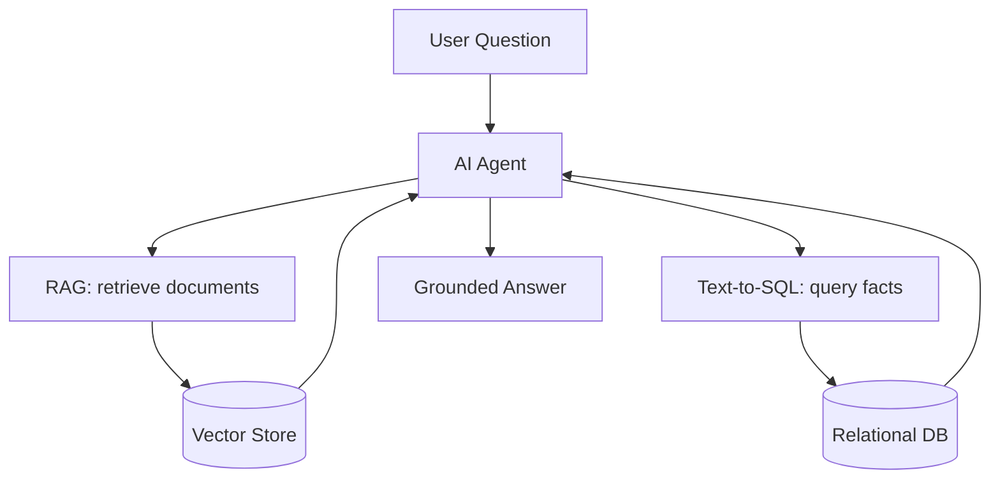

# How AI Actually Uses Your Database

> **Level:** L8 (AI & Agentic Systems Builder) · **Reading time:** 9 minutes

---

## 🎣 The Hook

Everyone thinks AI is "just the model." But ask ChatGPT about *your* company's revenue and it has no idea — it was trained on public text, not your database. The magic that makes AI useful for business isn't the model. It's the **data retrieval layer** underneath it. And that layer is SQL.

---

## 💼 The Business Problem

The CDO wants an AI assistant that answers questions about DataVerse: *"What's our churn risk?" "How's Q4 revenue trending?"* The LLM is powerful but knows nothing about DataVerse. How do we connect AI to our data — safely and accurately?

---

## 🧠 The Concept: AI Needs Retrieval



An LLM is a reasoning engine with no knowledge of your data. To make it useful, you **retrieve relevant facts and feed them in** as context. Three mechanisms — all built on databases:

1. **Text-to-SQL** — the LLM writes a query against your relational data.
2. **RAG** — semantic search retrieves relevant documents.
3. **Knowledge graphs** — traverse relationships for reasoning.

---

## 1️⃣ Text-to-SQL

The LLM translates natural language into SQL:

```
User: "How many active employees are in Sales?"
LLM generates:
   SELECT COUNT(*) FROM employees e
   JOIN departments d ON e.department_id = d.department_id
   WHERE d.department_name = 'Sales' AND e.status = 'Active';
Result → "There are 12 active employees in Sales."
```

To do this reliably, you give the LLM your schema:

```sql
SELECT table_name, column_name, data_type
FROM information_schema.columns WHERE table_schema = 'public';
```

---

## 2️⃣ Vector Search + RAG

Text is converted to **embeddings** (vectors capturing meaning), stored alongside relational metadata using pgvector:

```sql
CREATE EXTENSION IF NOT EXISTS vector;
CREATE TABLE doc_embeddings (
    content TEXT, category VARCHAR(50), embedding vector(1536)
);

-- Retrieve the most relevant context for a question (this is RAG)
SELECT content FROM doc_embeddings
ORDER BY embedding <=> :question_embedding
LIMIT 4;
```

Those retrieved chunks become the LLM's context, so it answers from *your* facts — not hallucinations.

---

## 🔒 The Non-Negotiable: Security

AI gets **read-only** access. Always.

```sql
CREATE ROLE ai_readonly;
GRANT SELECT ON ALL TABLES IN SCHEMA public TO ai_readonly;
ALTER ROLE ai_readonly SET statement_timeout = '10s';
-- No INSERT/UPDATE/DELETE. Validate generated SQL (SELECT-only).
```

Never let an LLM execute arbitrary writes. Treat generated SQL and retrieved documents as untrusted (prompt-injection risk).

---

## 💡 The Takeaway

| AI capability | Database foundation |
|---------------|---------------------|
| "Chat with your data" | Text-to-SQL + schema |
| Grounded answers | RAG + vector search |
| Relationship reasoning | Knowledge graph (recursive CTEs) |
| ML features | Aggregation queries |

**SQL is how AI thinks about your data.** The model is the brain; SQL is the senses.

---

## 🏋️ Try It Yourself

1. Export your schema as LLM context using `information_schema`.
2. Create a pgvector embeddings table.
3. Write a RAG retrieval query and a read-only AI role.

→ Practice in [MISSION 14](../MISSIONS/MISSION-14/README.md) and [PROJECT 08](../PROJECTS/PROJECT-08/README.md).

---

## 🔗 References

- [Mission 14: SQL for AI](../MISSIONS/MISSION-14/README.md)
- [AI + SQL Cheat Sheet](../CHEATSHEETS/09-ai-sql-cheatsheet.md)

---

## 📣 LinkedIn Summary

> Ask ChatGPT about your company's revenue — it has no clue. It was trained on public text, not your database. The magic that makes AI useful for business isn't the model; it's the data retrieval layer underneath. And that layer is SQL. Here's how AI actually uses your database. 🧵

**SEO keywords:** AI and SQL, RAG, text-to-SQL, vector database, pgvector, LLM data retrieval, AI agents, embeddings, semantic search
