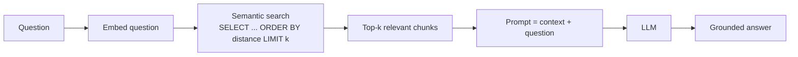

# RAG Explained Through SQL

> **Level:** L8 (AI & Agentic Systems Builder) · **Reading time:** 8 minutes

---

## 🎣 The Hook

RAG — Retrieval-Augmented Generation — is the most important pattern in applied AI right now. The acronym sounds intimidating, but if you understand a `SELECT ... ORDER BY ... LIMIT`, you already understand the core of RAG. Let me prove it.

---

## 💼 The Business Problem

DataVerse builds an HR chatbot. An employee asks: *"What's our parental leave policy?"* The LLM doesn't know DataVerse's specific policy — and if it guesses, it might invent something legally dangerous. RAG ensures it answers from the *actual* policy document.

---

## 🧠 The Concept

RAG = **retrieve** relevant data, then give it to the LLM as context so it generates a grounded answer.



The whole trick is the **retrieval step** — and it's a SQL query.

---

## 🔢 Step 1: Embeddings

Text is converted into a vector (a list of numbers) that captures meaning. Similar meanings → nearby vectors. We store these with pgvector:

```sql
CREATE EXTENSION IF NOT EXISTS vector;

CREATE TABLE policy_chunks (
    chunk_id   SERIAL PRIMARY KEY,
    content    TEXT,
    category   VARCHAR(50),
    embedding  vector(1536)
);
CREATE INDEX ON policy_chunks USING ivfflat (embedding vector_cosine_ops);
```

---

## 🔍 Step 2: Semantic Search (the SELECT)

When a question comes in, we embed it and find the nearest chunks by vector distance:

```sql
-- "<=>" is cosine distance — smaller means more similar
SELECT content, 1 - (embedding <=> :question_vec) AS similarity
FROM policy_chunks
ORDER BY embedding <=> :question_vec   -- nearest first
LIMIT 4;
```

That's it. `ORDER BY distance LIMIT 4` is the heart of RAG. You're just sorting by "closeness in meaning."

---

## 🎯 The SQL Advantage: Hybrid Search

Pure vector databases struggle with filtering. PostgreSQL + pgvector does both — combine semantic similarity with structured filters:

```sql
SELECT content, 1 - (embedding <=> :q) AS similarity
FROM policy_chunks
WHERE category = 'HR Policy'        -- metadata filter narrows the search
ORDER BY embedding <=> :q
LIMIT 4;
```

This precision is why relational skills matter even in AI.

---

## 🧩 Step 3: Augment & Generate

The retrieved chunks become the LLM's context:

```
Prompt to LLM:
  "Using ONLY the following context, answer the question.
   Context: [4 retrieved policy chunks]
   Question: What's our parental leave policy?"
```

Because the model answers *from retrieved facts*, it doesn't hallucinate. That's "Retrieval-Augmented Generation."

---

## 🏋️ Try It Yourself

1. Create a pgvector table for document chunks.
2. Write the semantic search query (top 4 by cosine distance).
3. Add a hybrid filter by category.

→ Practice in [MISSION 14](../MISSIONS/MISSION-14/README.md).

---

## 🔗 References

- [Mission 14: SQL for AI](../MISSIONS/MISSION-14/README.md)
- [AI + SQL Cheat Sheet](../CHEATSHEETS/09-ai-sql-cheatsheet.md)

---

## 📣 LinkedIn Summary

> RAG sounds intimidating, but here's the secret: if you understand SELECT ... ORDER BY ... LIMIT, you already understand its core. Retrieval-Augmented Generation is just "find the most relevant chunks, then feed them to the LLM." Let me explain RAG entirely through SQL. 🧵

**SEO keywords:** RAG, retrieval augmented generation, pgvector, semantic search, vector database, embeddings, AI SQL, hybrid search, LLM grounding
