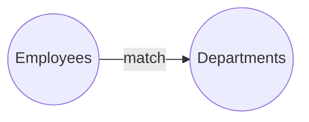

# 🔗 SQL Joins Cheat Sheet (PostgreSQL 17)

> Joins combine rows from multiple tables. Master these and you master SQL.

---

## The Join Types at a Glance

```
INNER JOIN   →  only matching rows in BOTH tables
LEFT JOIN    →  ALL left rows + matching right (NULLs if no match)
RIGHT JOIN   →  ALL right rows + matching left
FULL JOIN    →  ALL rows from both (NULLs where no match)
CROSS JOIN   →  every combination (Cartesian product)
SELF JOIN    →  table joined to itself
```

---

## INNER JOIN — Only Matches

```sql
SELECT e.first_name, d.department_name
FROM employees e
INNER JOIN departments d ON e.department_id = d.department_id;
```

Returns only employees who have a matching department.



## LEFT JOIN — Keep All Left

```sql
SELECT e.first_name, d.department_name
FROM employees e
LEFT JOIN departments d ON e.department_id = d.department_id;
```

Returns ALL employees, even those with no department (`NULL`).

> 💡 Most common for "show all X with their related Y, if any."

## RIGHT JOIN — Keep All Right

```sql
SELECT e.first_name, d.department_name
FROM employees e
RIGHT JOIN departments d ON e.department_id = d.department_id;
```

Returns ALL departments, even ones with no employees.

## FULL OUTER JOIN — Keep Everything

```sql
SELECT e.first_name, d.department_name
FROM employees e
FULL OUTER JOIN departments d ON e.department_id = d.department_id;
```

All employees AND all departments, matched where possible.

## CROSS JOIN — Every Combination

```sql
SELECT p.product_name, c.company_name
FROM products p
CROSS JOIN customers c;     -- 42 products × 40 customers = 1680 rows
```

## SELF JOIN — Table to Itself

```sql
-- Employees with their managers
SELECT e.first_name AS employee, m.first_name AS manager
FROM employees e
LEFT JOIN employees m ON e.manager_id = m.employee_id;
```

---

## Finding Unmatched Rows (Anti-Join)

```sql
-- Employees with NO orders (using LEFT JOIN + IS NULL)
SELECT e.first_name
FROM employees e
LEFT JOIN orders o ON e.employee_id = o.sales_rep_id
WHERE o.order_id IS NULL;
```

## Multiple Joins

```sql
SELECT o.order_id, c.company_name, e.first_name AS rep, p.product_name
FROM orders o
JOIN customers c     ON o.customer_id = c.customer_id
JOIN employees e     ON o.sales_rep_id = e.employee_id
JOIN order_items oi  ON o.order_id = oi.order_id
JOIN products p      ON oi.product_id = p.product_id;
```

## Aggregating with Joins

```sql
SELECT d.department_name, COUNT(e.employee_id) AS headcount
FROM departments d
LEFT JOIN employees e ON d.department_id = e.department_id
GROUP BY d.department_name;   -- LEFT keeps depts with 0 employees
```

---

## 🧠 Join Decision Guide

| Question | Join |
|----------|------|
| Only rows that match in both? | `INNER JOIN` |
| All from table A, matches from B? | `LEFT JOIN` |
| All from table B, matches from A? | `RIGHT JOIN` |
| Everything from both? | `FULL OUTER JOIN` |
| Every combination? | `CROSS JOIN` |
| Compare a table to itself (hierarchy)? | `SELF JOIN` |
| Rows in A NOT in B? | `LEFT JOIN ... WHERE B.key IS NULL` |

---

## ⚠️ Common Mistakes

- **Forgetting the ON clause** → accidental cross join (huge result).
- **Using INNER when you need LEFT** → silently dropping rows.
- **Joining on the wrong columns** → wrong/inflated results.
- **Aggregating after INNER JOIN** → missing zero-count groups (use LEFT).
