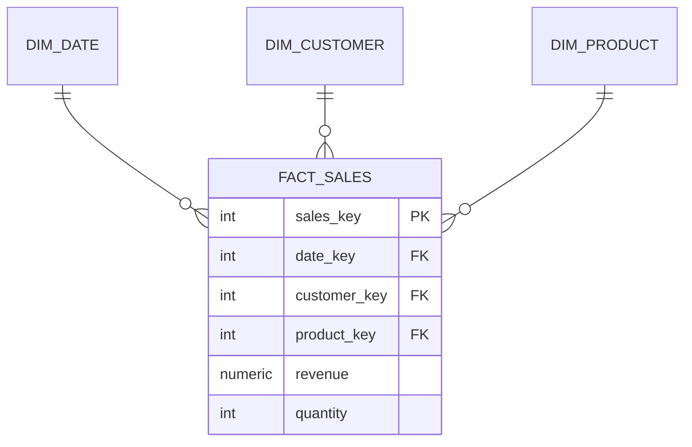

# 🏢 Data Warehouse SQL Cheat Sheet

> Dimensional modeling patterns for analytics at scale.

---

## Core Concepts

| Term | Meaning |
|------|---------|
| **Fact table** | Measurements/metrics (revenue, quantity) — many rows |
| **Dimension table** | Descriptive context (customer, product, date) |
| **Grain** | What one fact row represents (e.g. one line item) |
| **Surrogate key** | System-generated PK (not the business key) |
| **Star schema** | Fact in center, dimensions around it |
| **Snowflake schema** | Normalized dimensions (sub-dimensions) |
| **Measure** | A numeric fact column you aggregate |

---

## Star Schema Shape



## Building a Dimension (surrogate key)

```sql
CREATE TABLE dim_customer (
    customer_key  SERIAL PRIMARY KEY,   -- surrogate
    customer_id   INTEGER,              -- natural/business key
    company_name  VARCHAR(200),
    industry      VARCHAR(100),
    segment       VARCHAR(50)
);
```

## Building a Date Dimension

```sql
INSERT INTO dim_date
SELECT 
    TO_CHAR(d,'YYYYMMDD')::INT AS date_key,
    d, EXTRACT(YEAR FROM d), EXTRACT(QUARTER FROM d),
    EXTRACT(MONTH FROM d), TO_CHAR(d,'Month'),
    EXTRACT(DOW FROM d) IN (0,6) AS is_weekend
FROM generate_series('2022-01-01'::date,'2025-12-31','1 day') d;
```

## Building a Fact Table (ETL key lookup)

```sql
INSERT INTO fact_sales (date_key, customer_key, product_key, revenue, quantity)
SELECT dd.date_key, dc.customer_key, dp.product_key, st.revenue, st.quantity
FROM sales_transactions st
JOIN dim_date dd     ON dd.full_date = st.sale_date
JOIN dim_customer dc ON dc.customer_id = st.customer_id
JOIN dim_product dp  ON dp.product_id = st.product_id;
```

## Querying the Star

```sql
SELECT dc.industry, dd.year, dd.quarter, SUM(fs.revenue) AS revenue
FROM fact_sales fs
JOIN dim_customer dc ON fs.customer_key = dc.customer_key
JOIN dim_date dd     ON fs.date_key = dd.date_key
GROUP BY dc.industry, dd.year, dd.quarter;
```

---

## Slowly Changing Dimensions (SCD)

### Type 1 — Overwrite (no history)

```sql
UPDATE dim_customer SET segment = 'Enterprise' WHERE customer_id = 5;
```

### Type 2 — Track History (new row per change)

```sql
ALTER TABLE dim_customer
    ADD COLUMN valid_from DATE DEFAULT CURRENT_DATE,
    ADD COLUMN valid_to   DATE DEFAULT '9999-12-31',
    ADD COLUMN is_current BOOLEAN DEFAULT TRUE;

-- Expire old, insert new
UPDATE dim_customer SET valid_to = CURRENT_DATE, is_current = FALSE
WHERE customer_id = 5 AND is_current;

INSERT INTO dim_customer (customer_id, segment, valid_from, is_current)
VALUES (5, 'Enterprise', CURRENT_DATE, TRUE);
```

### Type 3 — Previous Value Column

```sql
ALTER TABLE dim_customer ADD COLUMN previous_segment VARCHAR(50);
```

---

## Fact Table Types

| Type | Description | Example |
|------|-------------|---------|
| **Transaction** | One row per event | each sale |
| **Periodic snapshot** | State at intervals | daily inventory |
| **Accumulating snapshot** | Process milestones | order → ship → deliver |

---

## Aggregate / Summary Tables

```sql
-- Pre-aggregate for dashboard speed
CREATE TABLE agg_monthly_revenue AS
SELECT dd.year, dd.month, dc.industry, SUM(fs.revenue) AS revenue
FROM fact_sales fs
JOIN dim_date dd ON fs.date_key = dd.date_key
JOIN dim_customer dc ON fs.customer_key = dc.customer_key
GROUP BY dd.year, dd.month, dc.industry;
```

---

## 🧠 Design Checklist

- [ ] Define the **grain** first (what is one fact row?)
- [ ] Use **surrogate keys** in dimensions
- [ ] Keep facts **numeric and additive**
- [ ] Conform dimensions (reuse `dim_date` across facts)
- [ ] Choose SCD type per dimension (1 vs 2)
- [ ] Index all foreign keys on the fact table
- [ ] Build aggregate tables for common queries

---

## ⚠️ Common Mistakes

- Mixing grains in one fact table.
- Using natural keys instead of surrogate keys.
- Storing text descriptions in the fact (put them in dimensions).
- No date dimension (forces ugly date math everywhere).
