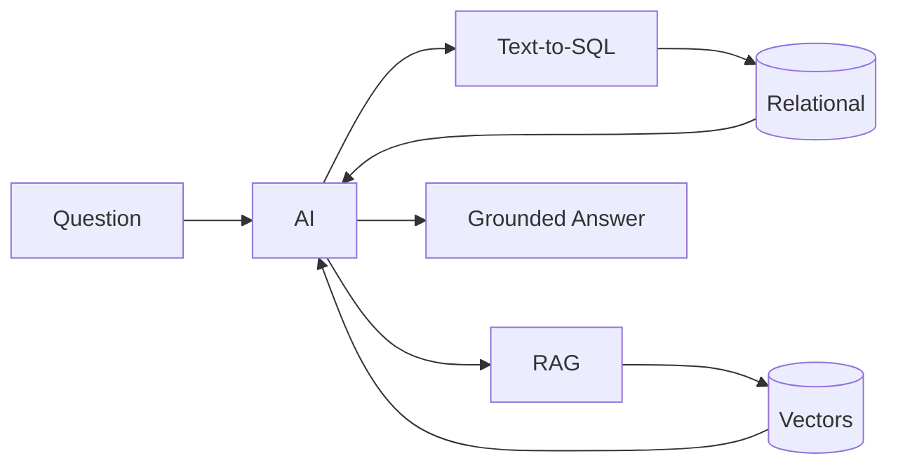

# 🤖 AI + SQL Cheat Sheet

> How SQL powers RAG, vector search, Text-to-SQL, and AI agents.

---

## The Mental Model

**AI doesn't know your data.** To answer questions about your business, AI must *retrieve* facts from your databases. That retrieval is SQL + vector search.



---

## pgvector — Vector Storage in PostgreSQL

```sql
CREATE EXTENSION IF NOT EXISTS vector;

CREATE TABLE embeddings (
    id         SERIAL PRIMARY KEY,
    content    TEXT,
    category   VARCHAR(50),       -- metadata for filtering
    embedding  vector(1536)       -- OpenAI embedding dimension
);

CREATE INDEX ON embeddings USING ivfflat (embedding vector_cosine_ops);
```

## Distance Operators

```sql
embedding <-> query   -- Euclidean (L2) distance
embedding <=> query   -- cosine distance (most common for text)
embedding <#> query   -- negative inner product
```

## Semantic Search

```sql
-- Top 5 most similar documents
SELECT content, 1 - (embedding <=> :query_vec) AS similarity
FROM embeddings
ORDER BY embedding <=> :query_vec
LIMIT 5;
```

## Hybrid Search (vector + SQL filter — the relational advantage)

```sql
SELECT content, 1 - (embedding <=> :q) AS similarity
FROM embeddings
WHERE category = 'HR Policy'        -- metadata filter
ORDER BY embedding <=> :q
LIMIT 5;
```

---

## RAG (Retrieval-Augmented Generation)

```sql
-- The retrieval step is SQL: get context chunks for the LLM
SELECT content
FROM embeddings
WHERE source_table = 'policies'
ORDER BY embedding <=> :question_embedding
LIMIT 4;
-- These chunks become the LLM's context → grounded, hallucination-free answer
```

**RAG flow:** embed question → semantic search → retrieve top-k → build prompt (context + question) → LLM answers from context.

---

## Text-to-SQL

```sql
-- Give the LLM your schema as context
SELECT table_name, column_name, data_type
FROM information_schema.columns
WHERE table_schema = 'public'
ORDER BY table_name, ordinal_position;
```

```
User: "Total revenue by category in 2024?"
LLM generates:
   SELECT p.category, SUM(st.revenue)
   FROM sales_transactions st JOIN products p ON st.product_id=p.product_id
   WHERE st.fiscal_year = 2024 GROUP BY p.category;
```

---

## 🔒 Security — Non-Negotiable for AI

```sql
-- AI agents get READ-ONLY access. Always.
CREATE ROLE ai_readonly;
GRANT USAGE ON SCHEMA public TO ai_readonly;
GRANT SELECT ON ALL TABLES IN SCHEMA public TO ai_readonly;
ALTER ROLE ai_readonly SET statement_timeout = '10s';
-- NO INSERT/UPDATE/DELETE/DROP
```

```python
# Validate generated SQL before running
assert sql.strip().upper().startswith("SELECT")
forbidden = ["INSERT","UPDATE","DELETE","DROP","ALTER","TRUNCATE","GRANT"]
assert not any(w in sql.upper() for w in forbidden)
```

---

## Knowledge Graphs (recursive CTEs)

```sql
CREATE TABLE kg_nodes (node_id SERIAL PRIMARY KEY, node_type VARCHAR, name VARCHAR);
CREATE TABLE kg_edges (from_node INT, to_node INT, relationship VARCHAR);

-- Traverse relationships
WITH RECURSIVE graph AS (
    SELECT from_node, to_node FROM kg_edges WHERE from_node = 1
    UNION ALL
    SELECT e.from_node, e.to_node FROM kg_edges e
    JOIN graph g ON e.from_node = g.to_node
)
SELECT * FROM graph;
```

---

## AI Agent Tools = SQL Queries

```python
def query_database(sql: str):       # agent's primary tool
    return execute_readonly(sql)

def semantic_search(vec, k=5):      # agent's retrieval tool
    return execute_readonly(f"SELECT content FROM embeddings ORDER BY embedding <=> '{vec}' LIMIT {k}")
```

The agent loops: **think → run SQL → observe → repeat → answer.**

---

## 🧠 Key Takeaways

| AI capability | SQL foundation |
|---------------|----------------|
| RAG | semantic search query |
| Vector DB | pgvector table + index |
| Text-to-SQL | information_schema export |
| AI agent tools | read-only SELECT queries |
| Knowledge graph | recursive CTEs |
| Feature store | aggregation queries |

> **SQL is the language AI uses to think about your data.**

---

## ⚠️ Security Reminders

- Agents run **read-only** with timeouts — never write access.
- Validate all LLM-generated SQL (SELECT-only allowlist).
- Treat retrieved documents as **untrusted** (prompt-injection risk).
- Audit-log every AI query.
