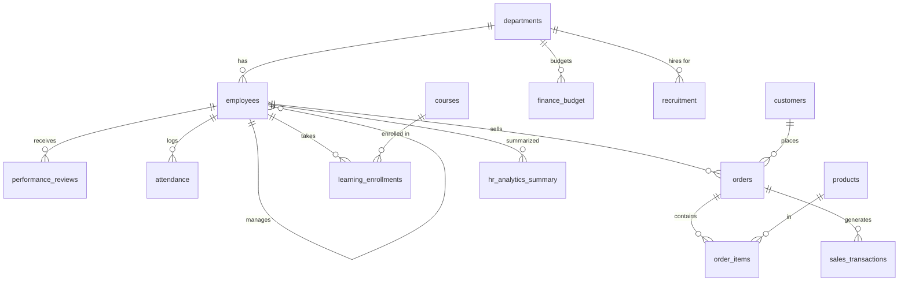

# 📊 DataVerse Inc. — Datasets

This folder contains all 12 business datasets used throughout the missions.

## Quick Load

```bash
psql -U postgres -d dataverse -f 00-load-all.sql
```

## Schema Overview



## Tables

| Table | Rows | Description |
|-------|------|-------------|
| `departments` | 12 | Company departments with budgets |
| `employees` | 90+ | Full employee directory with hierarchy |
| `products` | 42 | Product & service catalog |
| `customers` | 40+ | B2B customer accounts |
| `orders` | 70+ | Customer orders |
| `order_items` | 150+ | Line items per order |
| `sales_transactions` | 150+ | Revenue/profit fact table |
| `attendance` | 70+ | Daily attendance logs |
| `performance_reviews` | 40+ | Annual/H1 reviews |
| `recruitment` | 30 | Candidate pipeline |
| `courses` | 15 | L&D course catalog |
| `learning_enrollments` | 36 | Employee course enrollments |
| `finance_budget` | 96 | Budget vs actual by dept/quarter |
| `hr_analytics_summary` | 90+ | Denormalized HR analytics |

## Key Relationships

- `employees.manager_id` → `employees.employee_id` (self-referencing hierarchy)
- `employees.department_id` → `departments.department_id`
- `orders.customer_id` → `customers.customer_id`
- `orders.sales_rep_id` → `employees.employee_id`
- `order_items.product_id` → `products.product_id`

## Resetting

```sql
DROP DATABASE dataverse;
CREATE DATABASE dataverse;
```
Then reload with `00-load-all.sql`.

## Note on Row Counts

The original specification calls for 100+ rows per dataset. The seed scripts here provide representative, hand-crafted, referentially-consistent data optimized for learning. To inflate any table to 100+ rows for stress testing, use `generate_series`:

```sql
-- Example: generate 1000 synthetic attendance rows
INSERT INTO attendance (employee_id, work_date, hours_worked, attendance_type)
SELECT 
    (random() * 89 + 1)::INT,
    DATE '2024-01-01' + (random() * 180)::INT,
    8 + random() * 2,
    'Present'
FROM generate_series(1, 1000);
```
