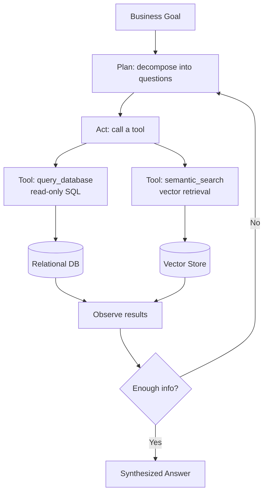
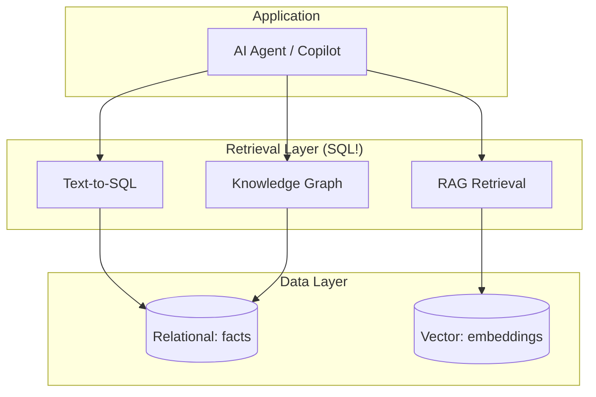
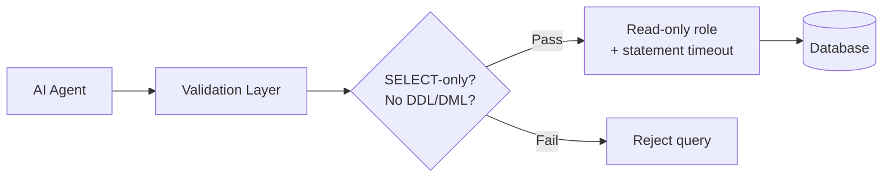

# 📊 Agentic AI Architecture

How an AI agent uses your database as its source of truth — thinking in a loop of plan → act (SQL) → observe → repeat.

---

## The Agent Loop



---

## The Full Stack



---

## Security Boundary (critical)



```sql
CREATE ROLE ai_agent_readonly;
GRANT SELECT ON ALL TABLES IN SCHEMA public TO ai_agent_readonly;
ALTER ROLE ai_agent_readonly SET statement_timeout = '15s';
-- NO INSERT/UPDATE/DELETE/DROP
```

---

## Worked Example

**Goal:** "Find our biggest revenue risks this quarter."

| Step | Agent action (SQL) |
|------|--------------------|
| 1 | Query high-value customers at churn risk |
| 2 | Compute revenue concentration (top-5 %) |
| 3 | Find declining product lines (QoQ) |
| 4 | RAG: retrieve playbook docs for recommendations |
| 5 | Synthesize a board-ready risk analysis |

Every "thought" the agent has becomes a SQL query. **SQL is the agent's sense of reality.**

→ Related: [Mission 14](../MISSIONS/MISSION-14/README.md) · [Project 08](../PROJECTS/PROJECT-08/README.md) · [AI+SQL Cheat Sheet](../CHEATSHEETS/09-ai-sql-cheatsheet.md)
