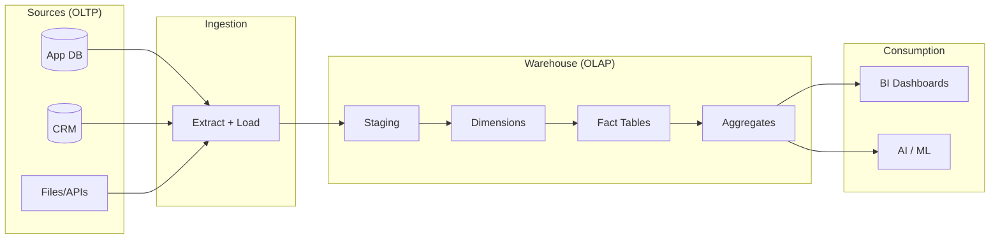
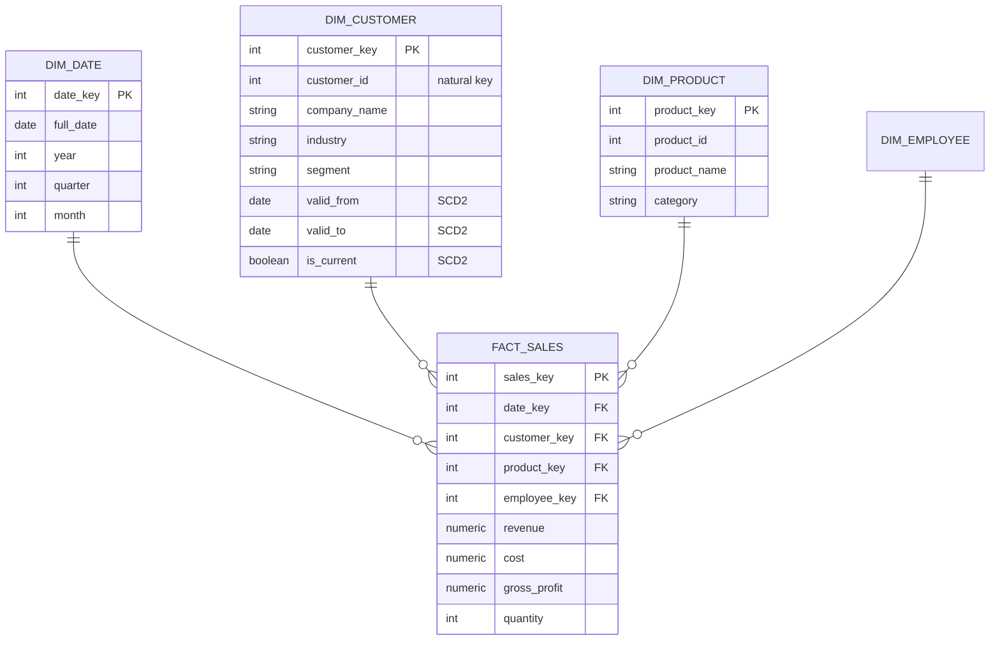
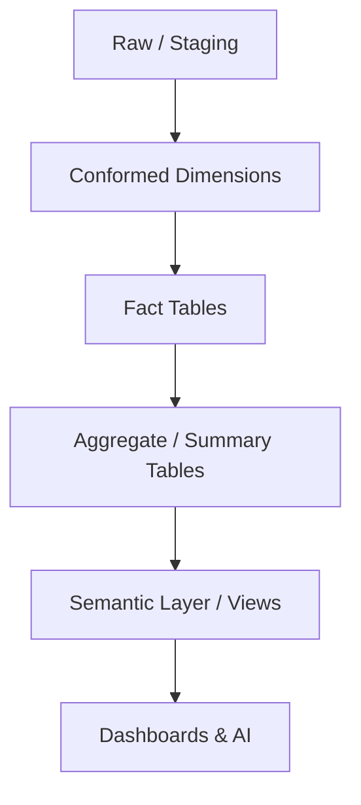

# 📊 Data Warehouse Architecture

How data flows from operational sources into a dimensional warehouse for analytics.

---

## End-to-End Flow

---

## The Star Schema (core of the warehouse)

---

## OLTP vs OLAP

| | OLTP (sources) | OLAP (warehouse) |
|--|----------------|------------------|
| Purpose | Run the business | Analyze the business |
| Design | Normalized | Dimensional (star) |
| Workload | Many small writes | Large reads/scans |
| Example | Place an order | Revenue by quarter |

---

## Layered Build

→ Related: [Mission 10](../MISSIONS/MISSION-10/README.md) · [Project 05](../PROJECTS/PROJECT-05/README.md) · [DW Cheat Sheet](../CHEATSHEETS/07-data-warehouse-sql.md)
