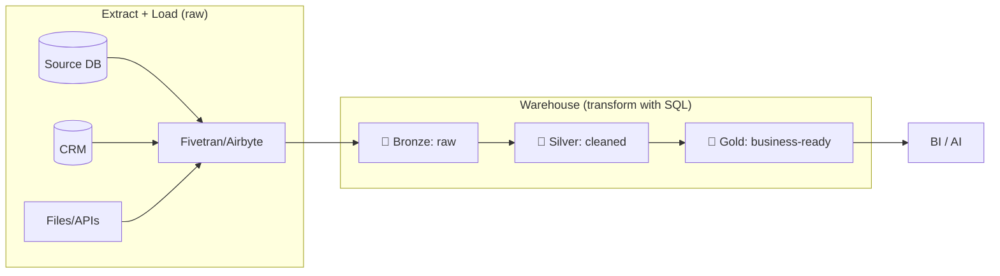
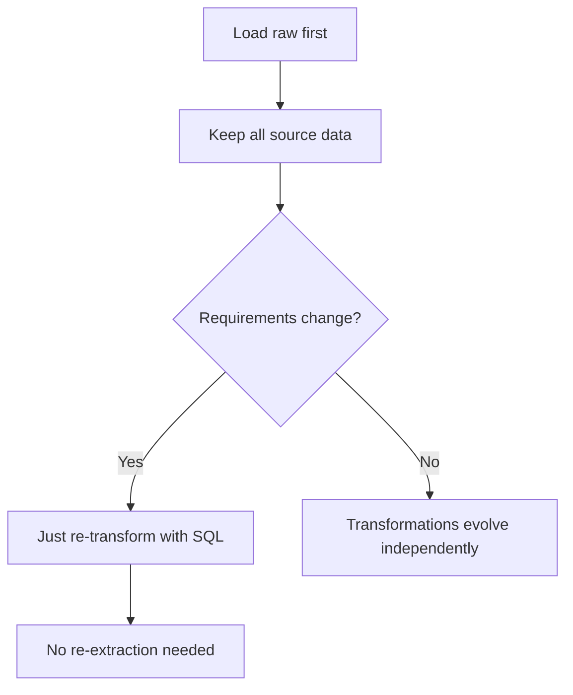

# 📊 ELT Flow

**ELT** = Extract → Load → Transform. Load raw data first, then transform *inside* the warehouse with SQL. The modern approach.

---

## The Flow



---

## Characteristics

| Aspect | Detail |
|--------|--------|
| Transform location | Inside the warehouse (SQL) |
| Data loaded | Raw, everything |
| Raw data | Always retained (replayable) |
| Born from | Cheap, elastic cloud compute |
| Tools | Fivetran/Airbyte + dbt + Snowflake/BigQuery |

---

## Why ELT Won



---

## The Medallion Transform (all SQL)

```sql
-- Silver: clean
CREATE TABLE silver_orders AS
SELECT order_id, UPPER(TRIM(status)) AS status, COALESCE(discount,0) AS discount
FROM bronze_orders WHERE order_date IS NOT NULL;

-- Gold: aggregate
CREATE TABLE gold_daily_revenue AS
SELECT order_date, SUM(revenue) AS revenue
FROM silver_orders GROUP BY order_date;
```

Every transformation is a SQL `SELECT` — version-controlled in dbt.

→ Compare with [ETL Flow](etl-flow.md) · Related: [Mission 12](../MISSIONS/MISSION-12/README.md) · [Medallion blog](../BLOGS/14-medallion-architecture.md)
