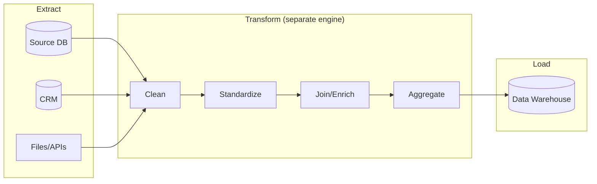

# 📊 ETL Flow

**ETL** = Extract → Transform → Load. Transform data *before* loading into the warehouse. Traditional approach.

---

## The Flow



---

## Characteristics

| Aspect | Detail |
|--------|--------|
| Transform location | Dedicated ETL server/engine |
| Data loaded | Only cleaned/transformed data |
| Raw data | Often discarded |
| Born from | Era of expensive storage/compute |
| Tools | Informatica, SSIS, Talend |

---

## When ETL Still Makes Sense

- **Regulatory masking** — must scrub PII *before* it lands.
- **Source-side constraints** — transform where the data already lives.
- **Fixed, well-known schemas** — no need to keep raw.

---

## Example Transform Step (conceptual)

```sql
-- Transformation happens BEFORE load
SELECT 
    order_id,
    UPPER(TRIM(status)) AS status,
    COALESCE(discount, 0) AS discount
FROM staging_orders
WHERE order_date IS NOT NULL;
-- result is then loaded into the warehouse
```

→ Compare with [ELT Flow](elt-flow.md) · Related: [Mission 12](../MISSIONS/MISSION-12/README.md)
