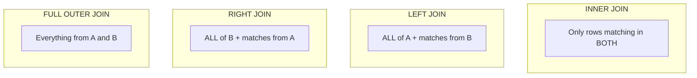
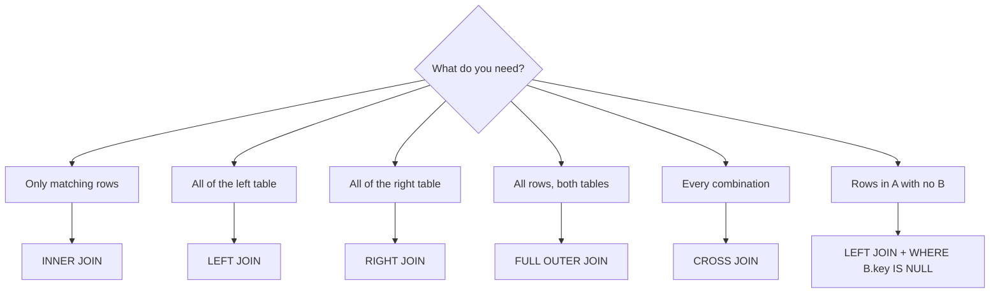

# 📊 SQL Join Types

A visual reference for how each join combines two tables, A (left) and B (right).

---

## Overview



---

## ASCII Venn Diagrams

```
INNER JOIN              LEFT JOIN               RIGHT JOIN
   A   B                   A   B                   A   B
  ( ∩ )                  (███∩ )                 ( ∩███)
  only overlap           all A + overlap         all B + overlap

FULL OUTER JOIN         LEFT ANTI (A only)      CROSS JOIN
   A   B                   A   B                  A × B
  (███████)              (███  )                 every combination
  everything             A without B match       (M × N rows)
```

---

## Side-by-Side

| Join | Keeps | NULLs appear for |
|------|-------|------------------|
| INNER | matches only | never |
| LEFT | all left + matches | unmatched left's right columns |
| RIGHT | all right + matches | unmatched right's left columns |
| FULL | all rows both sides | both sides where unmatched |
| CROSS | every combination | never (no condition) |

---

## Decision Flow



→ Related: [Mission 4](../MISSIONS/MISSION-04/README.md) · [Joins Cheat Sheet](../CHEATSHEETS/02-sql-joins.md)
