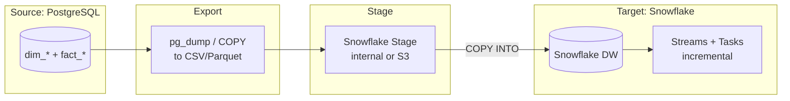
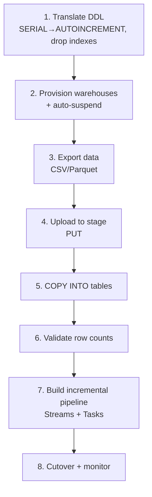

# 📊 PostgreSQL to Snowflake Migration

The path from a self-managed PostgreSQL warehouse to a Snowflake cloud warehouse.

---

## Migration Flow



---

## Migration Steps



---

## What Changes

| PostgreSQL | Snowflake |
|------------|-----------|
| `SERIAL` | `AUTOINCREMENT` |
| `NUMERIC(p,s)` | `NUMBER(p,s)` |
| `TEXT` | `VARCHAR` |
| `JSONB` | `VARIANT` |
| `CREATE INDEX` | *(automatic — drop them)* |
| `PARTITION BY` | `CLUSTER BY` (optional) |
| `VACUUM`/`ANALYZE` | *(automatic — remove)* |
| `REFRESH MATERIALIZED VIEW` | Dynamic Table (auto) |
| pg_dump / COPY | Stage + `COPY INTO` |

---

## What Stays the Same

```
SELECT, JOIN, GROUP BY, HAVING, ORDER BY, window functions,
CTEs, CASE, COALESCE, UNION/INTERSECT/EXCEPT, ILIKE — all unchanged.
```

90% of your queries migrate as-is. Effort concentrates on DDL, loading, and pipelines.

---

## Rollback Strategy

- Keep PostgreSQL running in parallel during validation.
- Compare row counts and key aggregates between systems.
- Use Snowflake **Zero-Copy Clone** for safe test runs.
- Cut over only after parity is confirmed.

→ Related: [Mission 11](../MISSIONS/MISSION-11/README.md) · [Project 06](../PROJECTS/PROJECT-06/README.md) · [Snowflake Cheat Sheet](../CHEATSHEETS/08-snowflake-sql-mapping.md)
