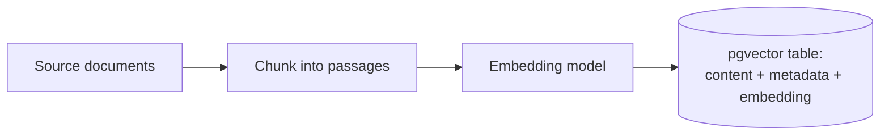
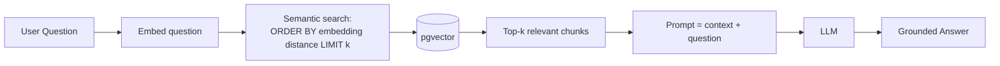
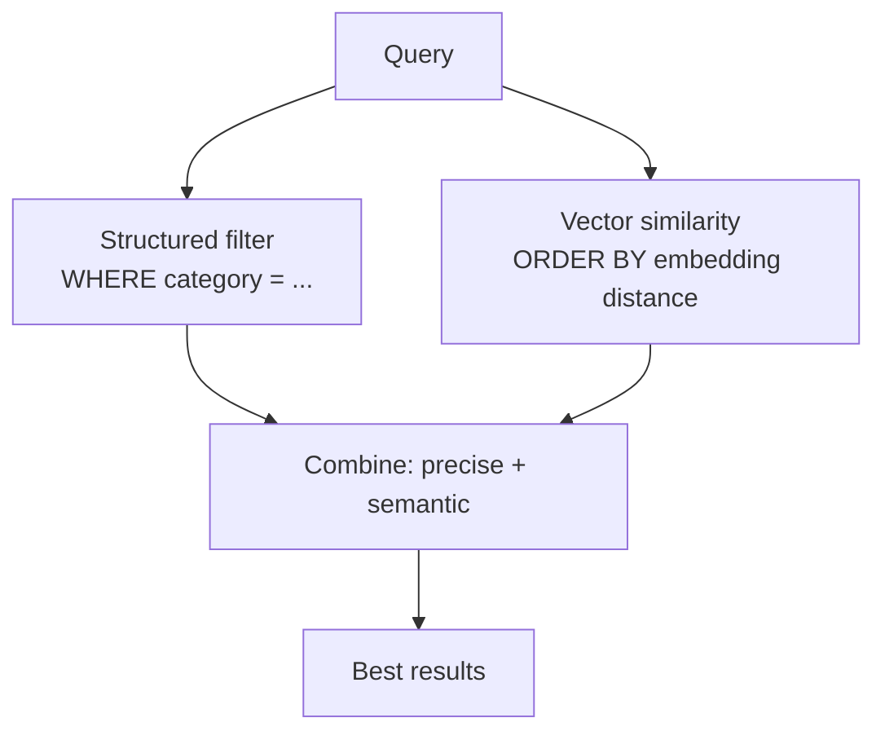

# 📊 RAG Architecture

Retrieval-Augmented Generation: ground an LLM in your data so it answers from facts, not hallucinations. The retrieval step is SQL.

---

## Ingestion (build the knowledge base)



```sql
CREATE EXTENSION IF NOT EXISTS vector;
CREATE TABLE doc_embeddings (
    content TEXT, category VARCHAR(50), embedding vector(1536)
);
CREATE INDEX ON doc_embeddings USING ivfflat (embedding vector_cosine_ops);
```

---

## Retrieval + Generation (answer a question)



```sql
-- The heart of RAG is this SELECT
SELECT content
FROM doc_embeddings
ORDER BY embedding <=> :question_embedding  -- cosine distance, nearest first
LIMIT 4;
```

---

## Hybrid Search (the SQL advantage)



```sql
SELECT content, 1 - (embedding <=> :q) AS similarity
FROM doc_embeddings
WHERE category = 'HR Policy'      -- metadata filter
ORDER BY embedding <=> :q
LIMIT 4;
```

---

## Why RAG Reduces Hallucination

| Without RAG | With RAG |
|-------------|----------|
| LLM guesses from training data | LLM answers from retrieved facts |
| May invent details | Grounded in your documents |
| No source | Traceable to source chunks |

→ Related: [Mission 14](../MISSIONS/MISSION-14/README.md) · [RAG blog](../BLOGS/19-rag-explained-through-sql.md) · [AI+SQL Cheat Sheet](../CHEATSHEETS/09-ai-sql-cheatsheet.md)
