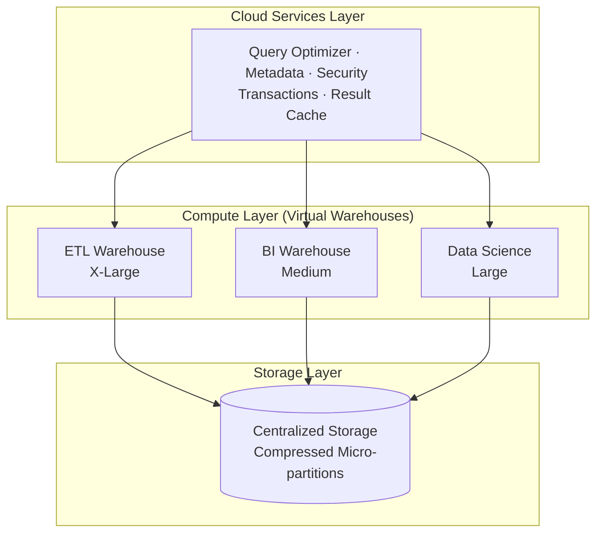
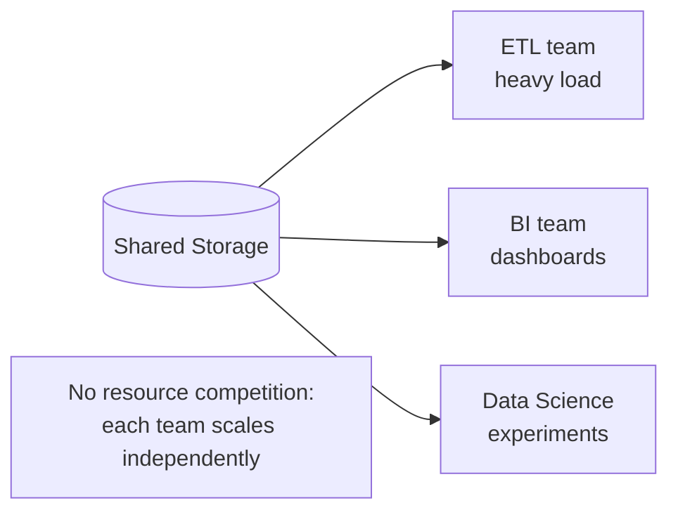
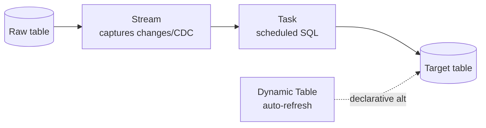

# 📊 Snowflake Architecture

Snowflake's defining innovation: **separation of storage and compute**, coordinated by a cloud services layer.

---

## The Three Layers

- **Cloud Services** — the brain: optimizes queries, manages metadata, security, transactions, and the result cache.
- **Compute** — independent virtual warehouses; scale each per workload, pay only while running.
- **Storage** — one copy of data; all warehouses read it without contention.

---

## Why Separation Matters

The ETL team can run a huge job on an X-Large warehouse while the BI team queries the same data on a Medium — no fighting for resources.

---

## Pipeline Features

---

## Cost Control & Operations

| Feature | Benefit |
|---------|---------|
| Auto-suspend | Stop billing when idle |
| Auto-resume | Wake on demand |
| Result cache | Repeat queries are free (24h) |
| Time Travel | Recover past data |
| Zero-Copy Clone | Instant free environments |
| Micro-partitions | Automatic — no index tuning |

→ Related: [Mission 11](../MISSIONS/MISSION-11/README.md) · [Project 06](../PROJECTS/PROJECT-06/README.md) · [Snowflake Cheat Sheet](../CHEATSHEETS/08-snowflake-sql-mapping.md)
