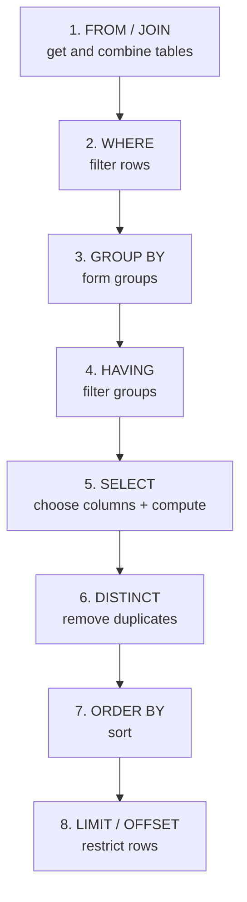

# 📊 SQL Execution Order

The order you **write** SQL is not the order the database **runs** it. Understanding this explains many "why doesn't this work?" moments.

---

## Written Order

```sql
SELECT      column_list
FROM        table
JOIN        other_table ON ...
WHERE       row_filter
GROUP BY    columns
HAVING      group_filter
ORDER BY    columns
LIMIT       n;
```

## Logical Execution Order



---

## Why It Matters

**1. You can't use a SELECT alias in WHERE:**

```sql
-- ❌ FAILS: alias not yet created when WHERE runs
SELECT salary * 12 AS annual FROM employees WHERE annual > 100000;

-- ✅ Works: repeat the expression, or use a subquery/CTE
SELECT salary * 12 AS annual FROM employees WHERE salary * 12 > 100000;
```

**2. You CAN use a SELECT alias in ORDER BY** (it runs after SELECT):

```sql
SELECT salary * 12 AS annual FROM employees ORDER BY annual DESC;  -- ✅
```

**3. WHERE can't use aggregates** (it runs before GROUP BY) — use HAVING:

```sql
-- ❌ WHERE COUNT(*) > 5
-- ✅ HAVING COUNT(*) > 5
```

---

## The One-Liner to Remember

```
FROM → WHERE → GROUP BY → HAVING → SELECT → DISTINCT → ORDER BY → LIMIT
```

> You write SELECT first, but the database reads FROM first.

→ Related: [Mission 1](../MISSIONS/MISSION-01/README.md) · [SQL Basics Cheat Sheet](../CHEATSHEETS/01-sql-basics.md)
