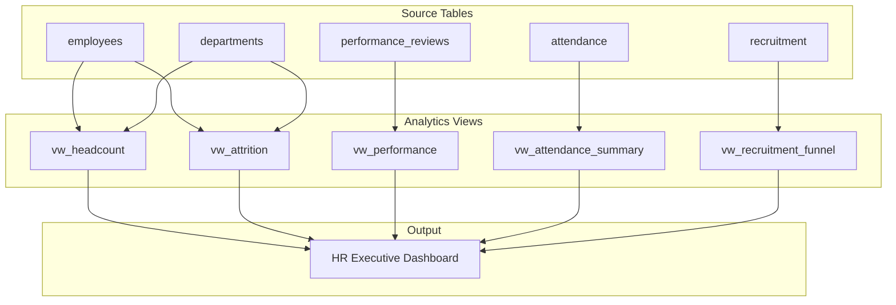

# 🏗️ PROJECT 01 — HR Analytics Platform

> **Level:** L2-L3 (Reporting Analyst → Analytics Engineer)
> **Skills:** Aggregations · Joins · CTEs · Window Functions · Views
> **Datasets:** `employees`, `departments`, `attendance`, `performance_reviews`, `recruitment`, `hr_analytics_summary`

---

## 📋 The Brief

> **From:** Patricia Williams (HR Director)
>
> *"I need a complete HR analytics platform — a set of reusable views and reports that answer every question the executive team throws at us: headcount, attrition, performance, attendance, and recruitment. Build it once, build it right."*

---

## 🎯 What You'll Build

A layered analytics platform with reusable views and an executive HR dashboard.



---

## 🛠️ Deliverables

### 1. Headcount View

```sql
CREATE OR REPLACE VIEW vw_headcount AS
SELECT 
    d.department_name,
    e.location,
    COUNT(*) FILTER (WHERE e.status = 'Active') AS active_count,
    COUNT(*) FILTER (WHERE e.employment_type = 'Full-Time') AS full_time,
    COUNT(*) FILTER (WHERE e.employment_type = 'Contract') AS contractors,
    ROUND(AVG(e.salary), 0) AS avg_salary
FROM employees e
JOIN departments d ON e.department_id = d.department_id
GROUP BY d.department_name, e.location;
```

### 2. Attrition View

```sql
CREATE OR REPLACE VIEW vw_attrition AS
SELECT 
    d.department_name,
    COUNT(*) AS total,
    COUNT(*) FILTER (WHERE e.status = 'Terminated') AS terminated,
    ROUND(100.0 * COUNT(*) FILTER (WHERE e.status = 'Terminated') 
          / NULLIF(COUNT(*), 0), 1) AS attrition_rate_pct
FROM employees e
JOIN departments d ON e.department_id = d.department_id
GROUP BY d.department_name;
```

### 3. Performance View

```sql
CREATE OR REPLACE VIEW vw_performance AS
SELECT 
    e.employee_id,
    e.first_name || ' ' || e.last_name AS employee,
    d.department_name,
    pr.review_period,
    pr.overall_rating,
    pr.performance_score,
    pr.goals_met_pct,
    pr.promoted,
    RANK() OVER (PARTITION BY d.department_name 
                 ORDER BY pr.performance_score DESC) AS dept_rank
FROM performance_reviews pr
JOIN employees e ON pr.employee_id = e.employee_id
JOIN departments d ON e.department_id = d.department_id;
```

### 4. Attendance Summary View

```sql
CREATE OR REPLACE VIEW vw_attendance_summary AS
SELECT 
    e.employee_id,
    e.first_name || ' ' || e.last_name AS employee,
    COUNT(*) FILTER (WHERE a.attendance_type = 'Present') AS days_present,
    COUNT(*) FILTER (WHERE a.attendance_type = 'Remote')  AS days_remote,
    COUNT(*) FILTER (WHERE a.attendance_type = 'Absent')  AS days_absent,
    ROUND(AVG(a.hours_worked), 1) AS avg_hours
FROM attendance a
JOIN employees e ON a.employee_id = e.employee_id
GROUP BY e.employee_id, e.first_name, e.last_name;
```

### 5. Executive HR Dashboard

```sql
SELECT 
    (SELECT COUNT(*) FROM employees WHERE status = 'Active')          AS active_employees,
    (SELECT ROUND(AVG(salary),0) FROM employees WHERE status='Active') AS avg_salary,
    (SELECT ROUND(100.0*COUNT(*) FILTER (WHERE status='Terminated')/COUNT(*),1)
        FROM employees)                                              AS attrition_pct,
    (SELECT ROUND(AVG(performance_score),1) FROM performance_reviews) AS avg_performance,
    (SELECT COUNT(*) FROM recruitment WHERE stage='Hired')           AS hires;
```

---

## 🏁 Acceptance Criteria

- [ ] All 5 views created and queryable
- [ ] Executive dashboard returns one summary row
- [ ] Attrition rate calculated correctly per department
- [ ] Performance rankings partition by department
- [ ] No NULL-division errors (uses `NULLIF`)

---

## 🚀 Stretch Goals

1. Add a `vw_flight_risk` view using `hr_analytics_summary` (flight_risk_score ≥ 7).
2. Add salary equity analysis by gender and department.
3. Build a diversity dashboard (age groups, gender distribution).
4. Materialize the dashboard view for performance.

---

## 📦 How to Present This (Portfolio)

- Put the SQL in a `hr_analytics_platform.sql` file.
- Add an ERD diagram (Mermaid) of the HR tables.
- Write a README explaining the business questions each view answers.
- Add 3 example dashboard screenshots (from pgAdmin/DBeaver/Metabase).
