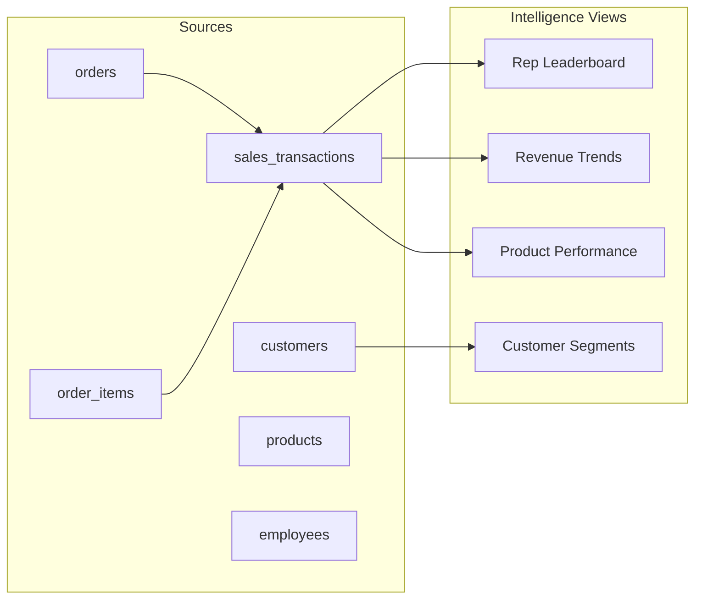

# 🏗️ PROJECT 02 — Sales Intelligence Platform

> **Level:** L2-L3 (Reporting Analyst → Analytics Engineer)
> **Skills:** Joins · Aggregations · Window Functions · CTEs · Date functions
> **Datasets:** `orders`, `order_items`, `sales_transactions`, `customers`, `products`, `employees`

---

## 📋 The Brief

> **From:** Robert Lee (VP Sales)
>
> *"I'm flying blind. I need a sales intelligence platform: rep leaderboards, revenue trends, product performance, customer segmentation, and a pipeline view. Build me the analytics that let me run this team like a data-driven machine."*

---

## 🎯 What You'll Build



---

## 🛠️ Deliverables

### 1. Sales Rep Leaderboard

```sql
CREATE OR REPLACE VIEW vw_rep_leaderboard AS
SELECT 
    e.first_name || ' ' || e.last_name AS rep,
    COUNT(DISTINCT st.order_id) AS deals,
    SUM(st.revenue)      AS revenue,
    SUM(st.gross_profit) AS profit,
    ROUND(AVG(st.revenue), 0) AS avg_deal_size,
    RANK() OVER (ORDER BY SUM(st.revenue) DESC) AS rank
FROM sales_transactions st
JOIN employees e ON st.sales_rep_id = e.employee_id
GROUP BY e.employee_id, e.first_name, e.last_name;
```

### 2. Revenue Trends (with growth)

```sql
CREATE OR REPLACE VIEW vw_revenue_trends AS
WITH monthly AS (
    SELECT DATE_TRUNC('month', sale_date) AS month,
           SUM(revenue) AS revenue
    FROM sales_transactions
    GROUP BY DATE_TRUNC('month', sale_date)
)
SELECT 
    month,
    revenue,
    LAG(revenue) OVER (ORDER BY month) AS prev_month,
    ROUND(100.0*(revenue - LAG(revenue) OVER (ORDER BY month))
          / NULLIF(LAG(revenue) OVER (ORDER BY month),0), 1) AS mom_growth_pct,
    SUM(revenue) OVER (ORDER BY month) AS cumulative_revenue
FROM monthly;
```

### 3. Product Performance

```sql
CREATE OR REPLACE VIEW vw_product_performance AS
SELECT 
    p.product_name,
    p.category,
    SUM(st.quantity)     AS units_sold,
    SUM(st.revenue)      AS revenue,
    SUM(st.gross_profit) AS profit,
    ROUND(100.0*SUM(st.gross_profit)/NULLIF(SUM(st.revenue),0),1) AS margin_pct,
    NTILE(4) OVER (ORDER BY SUM(st.revenue) DESC) AS revenue_quartile
FROM sales_transactions st
JOIN products p ON st.product_id = p.product_id
GROUP BY p.product_id, p.product_name, p.category;
```

### 4. Customer Segmentation

```sql
CREATE OR REPLACE VIEW vw_customer_segments AS
SELECT 
    c.company_name,
    c.industry,
    c.company_size,
    c.contract_tier,
    COALESCE(SUM(st.revenue),0) AS total_revenue,
    COUNT(DISTINCT o.order_id)  AS orders,
    c.lifetime_value,
    CASE 
        WHEN COALESCE(SUM(st.revenue),0) > 100000 THEN 'Platinum'
        WHEN COALESCE(SUM(st.revenue),0) > 50000  THEN 'Gold'
        WHEN COALESCE(SUM(st.revenue),0) > 10000  THEN 'Silver'
        ELSE 'Bronze'
    END AS segment
FROM customers c
LEFT JOIN orders o ON c.customer_id = o.customer_id
LEFT JOIN sales_transactions st ON o.order_id = st.order_id
GROUP BY c.customer_id, c.company_name, c.industry, c.company_size, 
         c.contract_tier, c.lifetime_value;
```

### 5. Sales Executive Dashboard

```sql
SELECT 
    (SELECT ROUND(SUM(revenue),0) FROM sales_transactions)        AS total_revenue,
    (SELECT ROUND(SUM(gross_profit),0) FROM sales_transactions)   AS total_profit,
    (SELECT COUNT(DISTINCT order_id) FROM sales_transactions)     AS total_deals,
    (SELECT ROUND(AVG(revenue),0) FROM sales_transactions)        AS avg_deal,
    (SELECT company_name FROM vw_customer_segments 
        ORDER BY total_revenue DESC LIMIT 1)                      AS top_customer;
```

---

## 🏁 Acceptance Criteria

- [ ] Rep leaderboard ranks by revenue
- [ ] Revenue trends show MoM growth and cumulative
- [ ] Product margins computed correctly
- [ ] Customers segmented into Platinum/Gold/Silver/Bronze
- [ ] Dashboard returns single KPI row

---

## 🚀 Stretch Goals

1. Add a quota-attainment view (assume $50K/quarter target per rep).
2. Build a regional/country revenue breakdown.
3. Add a "deals at risk" view (orders Pending > 30 days).
4. Compute customer churn rate by contract tier.

---

## 📦 Portfolio Presentation

- `sales_intelligence.sql` with all views
- Mermaid ERD of the sales schema
- A written "insights report" listing 5 findings from the data
