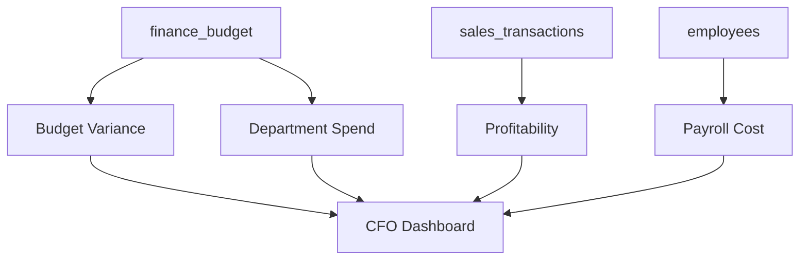

# 🏗️ PROJECT 03 — Finance Analytics Platform

> **Level:** L2-L3 (Reporting Analyst → Analytics Engineer)
> **Skills:** Aggregations · GROUP BY · GENERATED columns · CTEs · CASE
> **Datasets:** `finance_budget`, `departments`, `sales_transactions`, `employees`

---

## 📋 The Brief

> **From:** Michael Clark (Finance Manager)
>
> *"Budget season is chaos. I need a finance analytics platform: budget vs actual variance, departmental spend, profitability, and a CFO dashboard. I want to spot overspending before it becomes a problem."*

---

## 🎯 What You'll Build



---

## 🛠️ Deliverables

### 1. Budget vs Actual Variance

```sql
CREATE OR REPLACE VIEW vw_budget_variance AS
SELECT 
    d.department_name,
    fb.fiscal_year,
    fb.fiscal_quarter,
    fb.budget_category,
    fb.budgeted_amount,
    fb.actual_amount,
    fb.variance,                         -- GENERATED column
    fb.variance_pct,
    CASE 
        WHEN fb.variance > 0 THEN 'Over Budget'
        WHEN fb.variance < 0 THEN 'Under Budget'
        ELSE 'On Budget'
    END AS status
FROM finance_budget fb
JOIN departments d ON fb.department_id = d.department_id;
```

### 2. Department Spend Summary

```sql
CREATE OR REPLACE VIEW vw_department_spend AS
SELECT 
    d.department_name,
    fb.fiscal_year,
    SUM(fb.budgeted_amount) AS total_budget,
    SUM(fb.actual_amount)   AS total_actual,
    SUM(fb.variance)        AS total_variance,
    ROUND(100.0*SUM(fb.variance)/NULLIF(SUM(fb.budgeted_amount),0),1) AS variance_pct
FROM finance_budget fb
JOIN departments d ON fb.department_id = d.department_id
GROUP BY d.department_name, fb.fiscal_year
ORDER BY total_variance DESC;
```

### 3. Profitability View

```sql
CREATE OR REPLACE VIEW vw_profitability AS
SELECT 
    fiscal_year,
    fiscal_quarter,
    SUM(revenue)      AS revenue,
    SUM(cost)         AS cost,
    SUM(gross_profit) AS gross_profit,
    ROUND(100.0*SUM(gross_profit)/NULLIF(SUM(revenue),0),1) AS margin_pct
FROM sales_transactions
GROUP BY fiscal_year, fiscal_quarter
ORDER BY fiscal_year, fiscal_quarter;
```

### 4. Payroll Cost by Department

```sql
CREATE OR REPLACE VIEW vw_payroll_cost AS
SELECT 
    d.department_name,
    COUNT(*) FILTER (WHERE e.status='Active') AS active_employees,
    SUM(e.salary) FILTER (WHERE e.status='Active') AS annual_payroll,
    ROUND(AVG(e.salary) FILTER (WHERE e.status='Active'),0) AS avg_salary
FROM employees e
JOIN departments d ON e.department_id = d.department_id
GROUP BY d.department_name
ORDER BY annual_payroll DESC NULLS LAST;
```

### 5. CFO Dashboard

```sql
SELECT 
    (SELECT SUM(actual_amount) FROM finance_budget WHERE fiscal_year=2024)   AS total_spend_2024,
    (SELECT SUM(variance) FROM finance_budget WHERE fiscal_year=2024)        AS total_variance_2024,
    (SELECT ROUND(SUM(gross_profit),0) FROM sales_transactions)             AS gross_profit,
    (SELECT SUM(salary) FROM employees WHERE status='Active')               AS annual_payroll,
    (SELECT d.department_name FROM vw_department_spend v 
        JOIN departments d ON v.department_name=d.department_name
        ORDER BY v.total_variance DESC LIMIT 1)                            AS biggest_overspender;
```

---

## 🏁 Acceptance Criteria

- [ ] Variance uses the GENERATED column from `finance_budget`
- [ ] Over/Under budget correctly flagged
- [ ] Profit margins computed per quarter
- [ ] Payroll only counts active employees
- [ ] CFO dashboard returns one row

---

## 🚀 Stretch Goals

1. Add YoY budget growth comparison (2023 vs 2024).
2. Build a forecast view (linear trend on quarterly actuals).
3. Add a "budget alert" view (departments >10% over budget).
4. Compute cost-per-employee by department.

---

## 📦 Portfolio Presentation

- `finance_analytics.sql`
- A variance waterfall explanation
- 5 finance insights written as an executive memo
