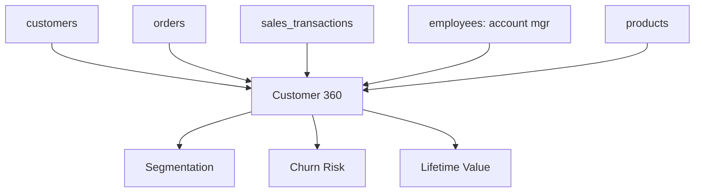

# 🏗️ PROJECT 04 — Customer 360

> **Level:** L3-L4 (Analytics Engineer → Data Engineer)
> **Skills:** Multi-table Joins · CTEs · Window Functions · Aggregation · Denormalization
> **Datasets:** `customers`, `orders`, `order_items`, `sales_transactions`, `employees`, `products`

---

## 📋 The Brief

> **From:** Matthew Turner (Marketing Director) & Angela Davis (CDO)
>
> *"We have customer data scattered across orders, sales, and account management. I need a single Customer 360 view — one row per customer with everything: revenue, orders, products bought, account manager, engagement, and risk. The single source of truth for every customer."*

---

## 🎯 What You'll Build

A denormalized **Customer 360** table that unifies every customer signal into one place.



---

## 🛠️ Deliverables

### 1. The Customer 360 Build

```sql
CREATE TABLE customer_360 AS
WITH order_stats AS (
    SELECT 
        o.customer_id,
        COUNT(DISTINCT o.order_id) AS total_orders,
        MIN(o.order_date) AS first_order,
        MAX(o.order_date) AS last_order,
        COALESCE(SUM(st.revenue), 0)      AS total_revenue,
        COALESCE(SUM(st.gross_profit), 0) AS total_profit
    FROM orders o
    LEFT JOIN sales_transactions st ON o.order_id = st.order_id
    GROUP BY o.customer_id
),
top_product AS (
    SELECT DISTINCT ON (o.customer_id)
        o.customer_id,
        p.product_name AS favorite_product
    FROM orders o
    JOIN sales_transactions st ON o.order_id = st.order_id
    JOIN products p ON st.product_id = p.product_id
    GROUP BY o.customer_id, p.product_name
    ORDER BY o.customer_id, SUM(st.revenue) DESC
)
SELECT 
    c.customer_id,
    c.company_name,
    c.industry,
    c.company_size,
    c.country,
    c.contract_tier,
    c.customer_status,
    c.nps_score,
    c.acquisition_date,
    c.last_activity_date,
    am.first_name || ' ' || am.last_name AS account_manager,
    COALESCE(os.total_orders, 0)  AS total_orders,
    COALESCE(os.total_revenue, 0) AS total_revenue,
    COALESCE(os.total_profit, 0)  AS total_profit,
    os.first_order,
    os.last_order,
    tp.favorite_product,
    -- Derived: tenure
    (CURRENT_DATE - c.acquisition_date) AS tenure_days,
    -- Derived: churn risk
    CASE 
        WHEN c.customer_status = 'Churned' THEN 'Churned'
        WHEN c.last_activity_date < CURRENT_DATE - INTERVAL '90 days' THEN 'High Risk'
        WHEN c.last_activity_date < CURRENT_DATE - INTERVAL '30 days' THEN 'Medium Risk'
        ELSE 'Healthy'
    END AS churn_risk,
    -- Derived: value segment
    CASE 
        WHEN COALESCE(os.total_revenue,0) > 100000 THEN 'Platinum'
        WHEN COALESCE(os.total_revenue,0) > 50000  THEN 'Gold'
        WHEN COALESCE(os.total_revenue,0) > 10000  THEN 'Silver'
        ELSE 'Bronze'
    END AS value_segment
FROM customers c
LEFT JOIN employees am ON c.account_manager_id = am.employee_id
LEFT JOIN order_stats os ON c.customer_id = os.customer_id
LEFT JOIN top_product tp ON c.customer_id = tp.customer_id;
```

### 2. Query the 360

```sql
-- High-value customers at churn risk (priority outreach list)
SELECT company_name, account_manager, total_revenue, churn_risk, nps_score
FROM customer_360
WHERE value_segment IN ('Platinum','Gold')
  AND churn_risk IN ('High Risk','Medium Risk')
ORDER BY total_revenue DESC;

-- Account manager performance
SELECT 
    account_manager,
    COUNT(*) AS accounts,
    SUM(total_revenue) AS book_of_business,
    ROUND(AVG(nps_score),1) AS avg_nps
FROM customer_360
WHERE account_manager IS NOT NULL
GROUP BY account_manager
ORDER BY book_of_business DESC;
```

---

## 🏁 Acceptance Criteria

- [ ] One row per customer in `customer_360`
- [ ] Revenue/orders aggregated correctly (LEFT JOINs preserve all customers)
- [ ] `DISTINCT ON` used for favorite product
- [ ] Churn risk and value segment derived columns present
- [ ] Account manager joined from employees

---

## 🚀 Stretch Goals

1. Convert to a **materialized view** with a refresh strategy.
2. Add RFM scoring (Recency, Frequency, Monetary).
3. Add a `next_best_action` column with CASE logic.
4. Build an incremental refresh using `MERGE`.

---

## 📦 Portfolio Presentation

- `customer_360.sql`
- Explain why denormalization helps BI tools
- A Mermaid diagram of all source tables feeding the 360
- 5 customer insights derived from the table
