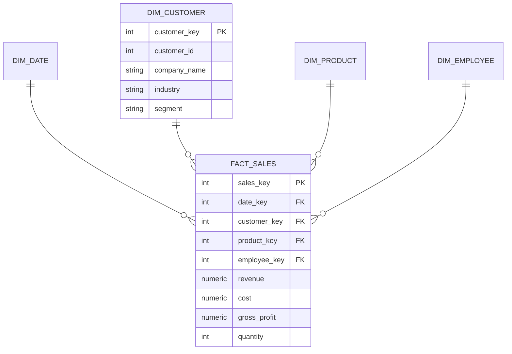

# 🏗️ PROJECT 05 — Data Warehouse Design

> **Level:** L7 (Data Architect)
> **Skills:** Star Schema · Fact/Dimension tables · Surrogate keys · SCD Type 2 · ETL
> **Datasets:** All — this is the enterprise warehouse build

---

## 📋 The Brief

> **From:** Marcus Thompson (CTO) & Angela Davis (CDO)
>
> *"Our analysts are joining 8 tables for every report. It's slow and error-prone. Design a proper dimensional data warehouse — a star schema with fact and dimension tables — that makes analytics fast and intuitive. This is the foundation of our entire BI strategy."*

---

## 🎯 What You'll Build

A **star schema** for sales analytics with a central fact table and conformed dimensions.



---

## 🛠️ Deliverables

### 1. Date Dimension

```sql
CREATE TABLE dim_date (
    date_key      INTEGER PRIMARY KEY,    -- YYYYMMDD surrogate
    full_date     DATE NOT NULL,
    year          INTEGER,
    quarter       INTEGER,
    month         INTEGER,
    month_name    VARCHAR(20),
    day_of_month  INTEGER,
    day_of_week   INTEGER,
    day_name      VARCHAR(20),
    is_weekend    BOOLEAN
);

-- Populate using generate_series
INSERT INTO dim_date
SELECT 
    TO_CHAR(d, 'YYYYMMDD')::INTEGER AS date_key,
    d AS full_date,
    EXTRACT(YEAR FROM d),
    EXTRACT(QUARTER FROM d),
    EXTRACT(MONTH FROM d),
    TO_CHAR(d, 'Month'),
    EXTRACT(DAY FROM d),
    EXTRACT(DOW FROM d),
    TO_CHAR(d, 'Day'),
    EXTRACT(DOW FROM d) IN (0, 6)
FROM generate_series('2022-01-01'::date, '2025-12-31'::date, '1 day') AS d;
```

### 2. Customer Dimension (with surrogate key)

```sql
CREATE TABLE dim_customer (
    customer_key  SERIAL PRIMARY KEY,     -- surrogate key
    customer_id   INTEGER,                -- natural/business key
    company_name  VARCHAR(200),
    industry      VARCHAR(100),
    company_size  VARCHAR(50),
    country       VARCHAR(100),
    contract_tier VARCHAR(50),
    segment       VARCHAR(50)
);

INSERT INTO dim_customer (customer_id, company_name, industry, company_size, country, contract_tier, segment)
SELECT customer_id, company_name, industry, company_size, country, contract_tier,
    CASE WHEN lifetime_value > 100000 THEN 'Enterprise'
         WHEN lifetime_value > 25000 THEN 'Mid' ELSE 'SMB' END
FROM customers;
```

### 3. Product & Employee Dimensions

```sql
CREATE TABLE dim_product (
    product_key  SERIAL PRIMARY KEY,
    product_id   INTEGER,
    product_name VARCHAR(200),
    category     VARCHAR(100),
    subcategory  VARCHAR(100)
);
INSERT INTO dim_product (product_id, product_name, category, subcategory)
SELECT product_id, product_name, category, subcategory FROM products;

CREATE TABLE dim_employee (
    employee_key SERIAL PRIMARY KEY,
    employee_id  INTEGER,
    full_name    VARCHAR(200),
    department   VARCHAR(100),
    job_title    VARCHAR(100)
);
INSERT INTO dim_employee (employee_id, full_name, department, job_title)
SELECT e.employee_id, e.first_name||' '||e.last_name, d.department_name, e.job_title
FROM employees e JOIN departments d ON e.department_id = d.department_id;
```

### 4. Fact Table (ETL load with surrogate key lookups)

```sql
CREATE TABLE fact_sales (
    sales_key     SERIAL PRIMARY KEY,
    date_key      INTEGER REFERENCES dim_date(date_key),
    customer_key  INTEGER REFERENCES dim_customer(customer_key),
    product_key   INTEGER REFERENCES dim_product(product_key),
    employee_key  INTEGER REFERENCES dim_employee(employee_key),
    quantity      INTEGER,
    revenue       NUMERIC(12,2),
    cost          NUMERIC(12,2),
    gross_profit  NUMERIC(12,2)
);

-- ETL: replace natural keys with surrogate keys via joins
INSERT INTO fact_sales (date_key, customer_key, product_key, employee_key, quantity, revenue, cost, gross_profit)
SELECT 
    dd.date_key,
    dc.customer_key,
    dp.product_key,
    de.employee_key,
    st.quantity,
    st.revenue,
    st.cost,
    st.gross_profit
FROM sales_transactions st
JOIN orders o      ON st.order_id = o.order_id
JOIN dim_date dd   ON dd.full_date = st.sale_date
JOIN dim_customer dc ON dc.customer_id = o.customer_id
JOIN dim_product dp  ON dp.product_id = st.product_id
JOIN dim_employee de ON de.employee_id = st.sales_rep_id;
```

### 5. Star Schema Query (fast, intuitive)

```sql
-- Revenue by industry and quarter — clean star join
SELECT 
    dc.industry,
    dd.year,
    dd.quarter,
    SUM(fs.revenue) AS revenue,
    SUM(fs.gross_profit) AS profit
FROM fact_sales fs
JOIN dim_customer dc ON fs.customer_key = dc.customer_key
JOIN dim_date dd     ON fs.date_key = dd.date_key
GROUP BY dc.industry, dd.year, dd.quarter
ORDER BY revenue DESC;
```

### 6. SCD Type 2 (Bonus — track dimension history)

```sql
-- Add SCD2 columns to track changes over time
ALTER TABLE dim_customer
    ADD COLUMN valid_from DATE DEFAULT CURRENT_DATE,
    ADD COLUMN valid_to   DATE DEFAULT '9999-12-31',
    ADD COLUMN is_current BOOLEAN DEFAULT TRUE;

-- When a customer's tier changes: expire old row, insert new
-- 1. Expire the current row
UPDATE dim_customer 
SET valid_to = CURRENT_DATE, is_current = FALSE
WHERE customer_id = 5 AND is_current = TRUE;
-- 2. Insert the new version (with new tier)
INSERT INTO dim_customer (customer_id, company_name, industry, company_size, country, contract_tier, segment, valid_from, is_current)
VALUES (5, 'TechCorp', 'Technology', 'Enterprise', 'USA', 'Enterprise', 'Enterprise', CURRENT_DATE, TRUE);
```

---

## 🏁 Acceptance Criteria

- [ ] 4 dimensions + 1 fact table created
- [ ] Surrogate keys used (not natural keys) in the fact
- [ ] Date dimension populated via `generate_series`
- [ ] Fact ETL resolves natural keys → surrogate keys
- [ ] Star query joins fact to dimensions cleanly
- [ ] SCD2 columns demonstrate history tracking

---

## 🚀 Stretch Goals

1. Add a snowflake-schema variant (normalize product → category dimension).
2. Build aggregate/summary fact tables (daily, monthly rollups).
3. Add a junk dimension for order flags.
4. Create indexes on all foreign keys and measure query speedup.

---

## 📦 Portfolio Presentation

- `data_warehouse.sql` (full DDL + ETL)
- A Mermaid star-schema ERD
- Before/after: messy 8-table join vs clean star join
- A written explanation of why dimensional modeling matters
