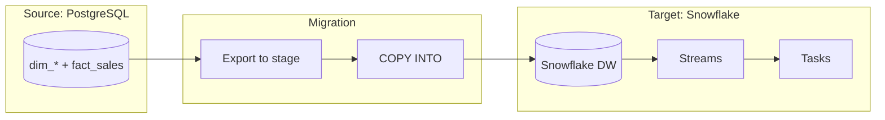

# 🏗️ PROJECT 06 — PostgreSQL to Snowflake Migration

> **Level:** L6 (Snowflake Developer)
> **Skills:** Snowflake DDL · Streams · Tasks · Time Travel · Cloning · Migration strategy
> **Datasets:** The star schema from Project 05

---

## 📋 The Brief

> **From:** Marcus Thompson (CTO)
>
> *"We're moving the data warehouse from PostgreSQL to Snowflake. I need a migration plan and the Snowflake equivalents of our schema — plus a strategy for incremental loading using Streams and Tasks. Show me how the cloud-native features improve our operations."*

---

## 🎯 What You'll Build

A complete migration blueprint from PostgreSQL star schema to a Snowflake cloud warehouse.



---

## 🛠️ Deliverables

### 1. Snowflake Warehouse Setup

```sql
-- Compute warehouses for different workloads
CREATE WAREHOUSE etl_wh   WAREHOUSE_SIZE='LARGE'  AUTO_SUSPEND=60 AUTO_RESUME=TRUE;
CREATE WAREHOUSE bi_wh    WAREHOUSE_SIZE='MEDIUM' AUTO_SUSPEND=60 AUTO_RESUME=TRUE;

CREATE DATABASE analytics_prod;
CREATE SCHEMA analytics_prod.dw;
USE SCHEMA analytics_prod.dw;
```

### 2. Snowflake DDL (migrated from PostgreSQL)

```sql
-- Note the type/syntax differences from PostgreSQL
CREATE TABLE dim_customer (
    customer_key   INTEGER AUTOINCREMENT,   -- was SERIAL
    customer_id    INTEGER,
    company_name   VARCHAR,                 -- no length needed
    industry       VARCHAR,
    company_size   VARCHAR,
    country         VARCHAR,
    contract_tier  VARCHAR,
    segment        VARCHAR
);

CREATE TABLE fact_sales (
    sales_key     INTEGER AUTOINCREMENT,
    date_key      INTEGER,
    customer_key  INTEGER,
    product_key   INTEGER,
    employee_key  INTEGER,
    quantity      INTEGER,
    revenue       NUMBER(12,2),
    cost          NUMBER(12,2),
    gross_profit  NUMBER(12,2)
)
CLUSTER BY (date_key);   -- replaces manual indexing/partitioning
```

### 3. Data Loading (Stage + COPY INTO)

```sql
-- Create an internal stage
CREATE STAGE dw_stage;

-- (Export PG tables to CSV/Parquet, upload to stage via SnowSQL PUT)
-- Then load:
COPY INTO fact_sales
FROM @dw_stage/fact_sales.parquet
FILE_FORMAT = (TYPE = PARQUET)
MATCH_BY_COLUMN_NAME = CASE_INSENSITIVE;
```

### 4. Incremental Pipeline (Streams + Tasks)

```sql
-- Raw landing table receives ongoing changes
CREATE TABLE raw_sales (LIKE fact_sales);

-- Stream tracks new rows
CREATE STREAM raw_sales_stream ON TABLE raw_sales;

-- Task processes the stream every hour
CREATE TASK load_fact_sales
    WAREHOUSE = etl_wh
    SCHEDULE = '60 MINUTE'
    WHEN SYSTEM$STREAM_HAS_DATA('raw_sales_stream')
AS
    INSERT INTO fact_sales
    SELECT date_key, customer_key, product_key, employee_key, quantity, revenue, cost, gross_profit
    FROM raw_sales_stream
    WHERE METADATA$ACTION = 'INSERT';

ALTER TASK load_fact_sales RESUME;
```

### 5. Cloud-Native Operations

```sql
-- Zero-Copy Clone: instant dev environment, no storage cost
CREATE DATABASE analytics_dev CLONE analytics_prod;

-- Time Travel: recover from a bad load
SELECT * FROM fact_sales AT (OFFSET => -3600);   -- 1 hour ago
INSERT INTO fact_sales SELECT * FROM fact_sales BEFORE (STATEMENT => '<bad_query_id>');

-- Dynamic Table: auto-refreshing aggregate
CREATE DYNAMIC TABLE daily_revenue
    TARGET_LAG = '1 hour' WAREHOUSE = etl_wh
AS SELECT date_key, SUM(revenue) AS revenue FROM fact_sales GROUP BY date_key;
```

---

## 🔄 Migration Mapping Reference

| PostgreSQL | Snowflake |
|------------|-----------|
| `SERIAL` | `AUTOINCREMENT` |
| `NUMERIC(12,2)` | `NUMBER(12,2)` |
| `TEXT` | `VARCHAR` |
| `CREATE INDEX` | `CLUSTER BY` (optional) |
| `REFRESH MATERIALIZED VIEW` | Dynamic Table (auto) |
| `VACUUM`/`ANALYZE` | automatic |
| pg_dump/COPY | `COPY INTO` + stage |

---

## 🏁 Acceptance Criteria

- [ ] Warehouses created with auto-suspend
- [ ] All dimensions + fact migrated to Snowflake DDL
- [ ] COPY INTO loading documented
- [ ] Stream + Task incremental pipeline built
- [ ] Time Travel and Cloning demonstrated
- [ ] Migration mapping table complete

---

## 🚀 Stretch Goals

1. Add a Task DAG (chained tasks for dim then fact loads).
2. Implement SCD2 in Snowflake using MERGE + streams.
3. Add resource monitors to cap warehouse spend.
4. Design a multi-cluster warehouse for high concurrency.

---

## 📦 Portfolio Presentation

- `snowflake_migration.sql`
- A migration runbook (steps, rollback plan)
- Cost comparison: PG self-managed vs Snowflake consumption
- Architecture diagram (warehouses, storage, pipelines)
