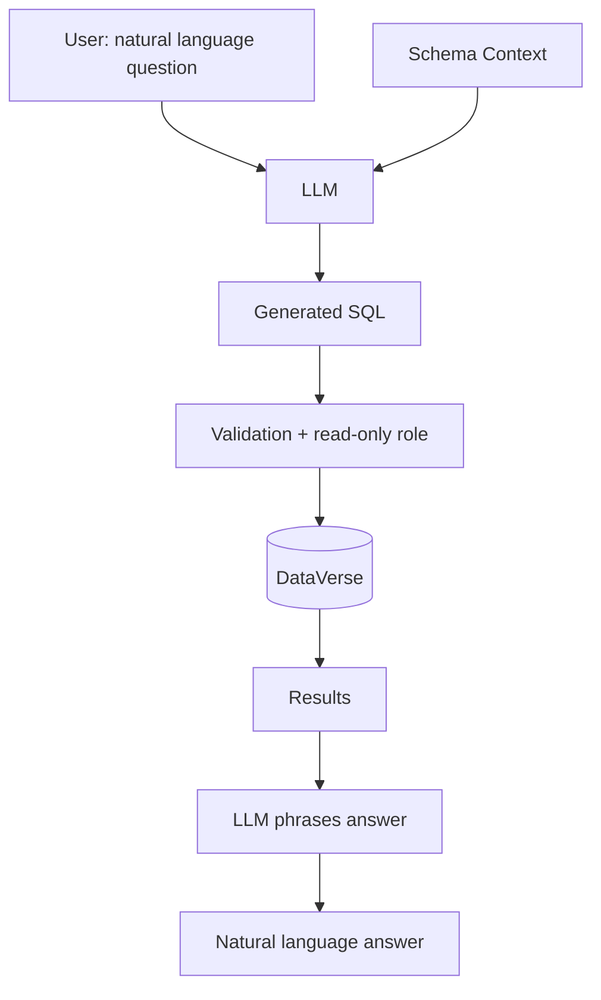

# 🏗️ PROJECT 07 — Text-to-SQL AI Assistant

> **Level:** L8 (AI & Agentic Systems Builder)
> **Skills:** Schema design · information_schema · Read-only security · Prompt context · Validation
> **Datasets:** All DataVerse tables

---

## 📋 The Brief

> **From:** Angela Davis (Chief Data Officer)
>
> *"I want every executive to be able to ask our data questions in plain English — 'What was Q4 revenue by region?' — and get an answer. Build the data foundation for a Text-to-SQL assistant: the schema context the LLM needs, the security guardrails, and the validation layer."*

---

## 🎯 What You'll Build

The data and security layer that makes an LLM-powered "chat with your data" assistant safe and accurate.



---

## 🛠️ Deliverables

### 1. Schema Context Export (the LLM's "knowledge")

```sql
-- Machine-readable schema for the LLM prompt
SELECT 
    t.table_name,
    c.column_name,
    c.data_type,
    CASE WHEN c.is_nullable = 'NO' THEN 'required' ELSE 'optional' END AS nullability
FROM information_schema.tables t
JOIN information_schema.columns c ON t.table_name = c.table_name
WHERE t.table_schema = 'public' AND t.table_type = 'BASE TABLE'
ORDER BY t.table_name, c.ordinal_position;
```

### 2. Foreign Key Map (so the LLM knows how to JOIN)

```sql
SELECT
    tc.table_name AS from_table,
    kcu.column_name AS from_column,
    ccu.table_name AS to_table,
    ccu.column_name AS to_column
FROM information_schema.table_constraints tc
JOIN information_schema.key_column_usage kcu 
    ON tc.constraint_name = kcu.constraint_name
JOIN information_schema.constraint_column_usage ccu 
    ON tc.constraint_name = ccu.constraint_name
WHERE tc.constraint_type = 'FOREIGN KEY';
```

### 3. Security Guardrail — Read-Only Role

```sql
-- The AI agent NEVER gets write access
CREATE ROLE ai_assistant_readonly;
GRANT CONNECT ON DATABASE dataverse TO ai_assistant_readonly;
GRANT USAGE ON SCHEMA public TO ai_assistant_readonly;
GRANT SELECT ON ALL TABLES IN SCHEMA public TO ai_assistant_readonly;
ALTER DEFAULT PRIVILEGES IN SCHEMA public 
    GRANT SELECT ON TABLES TO ai_assistant_readonly;

-- Set a statement timeout so runaway queries are killed
ALTER ROLE ai_assistant_readonly SET statement_timeout = '10s';
```

### 4. Example Text-to-SQL Translations

```
Q: "How many active employees are in each department?"
A:
   SELECT d.department_name, COUNT(*) AS active
   FROM employees e JOIN departments d ON e.department_id = d.department_id
   WHERE e.status = 'Active'
   GROUP BY d.department_name;

Q: "What was total revenue by product category in 2024?"
A:
   SELECT p.category, SUM(st.revenue) AS revenue
   FROM sales_transactions st JOIN products p ON st.product_id = p.product_id
   WHERE st.fiscal_year = 2024
   GROUP BY p.category ORDER BY revenue DESC;

Q: "Which 5 customers have the highest lifetime value?"
A:
   SELECT company_name, lifetime_value FROM customers
   ORDER BY lifetime_value DESC LIMIT 5;
```

### 5. Validation Layer (conceptual)

```python
# Pseudocode for the safety wrapper around LLM output
def run_text_to_sql(question: str) -> str:
    sql = llm_generate_sql(question, schema_context, fk_map)

    # GUARDRAILS:
    if not sql.strip().upper().startswith("SELECT"):
        raise ValueError("Only SELECT statements allowed")
    forbidden = ["INSERT","UPDATE","DELETE","DROP","ALTER","TRUNCATE","GRANT"]
    if any(word in sql.upper() for word in forbidden):
        raise ValueError("Write/DDL operations blocked")

    # Execute with the read-only role + timeout
    rows = execute_as_role(sql, role="ai_assistant_readonly")
    return llm_summarize(question, rows)
```

---

## 🏁 Acceptance Criteria

- [ ] Schema context query returns all tables/columns/types
- [ ] FK map query reveals join paths
- [ ] Read-only role created with SELECT-only + timeout
- [ ] 3+ example NL→SQL translations documented
- [ ] Validation layer blocks non-SELECT statements

---

## 🚀 Stretch Goals

1. Add table/column descriptions (`COMMENT ON`) for richer LLM context.
2. Build a few-shot example library (question → SQL pairs).
3. Add query-cost estimation (`EXPLAIN`) before running.
4. Log every generated query for audit.

---

## ⚠️ Security Notes

- **Never** let the LLM run with write privileges.
- Always validate generated SQL against an allowlist (SELECT only).
- Use statement timeouts to prevent runaway queries.
- Log all AI-generated queries for audit and prompt-injection detection.

---

## 📦 Portfolio Presentation

- `text_to_sql_foundation.sql`
- Schema-context export sample
- A security writeup explaining the read-only guardrails
- 10 example question→SQL pairs
