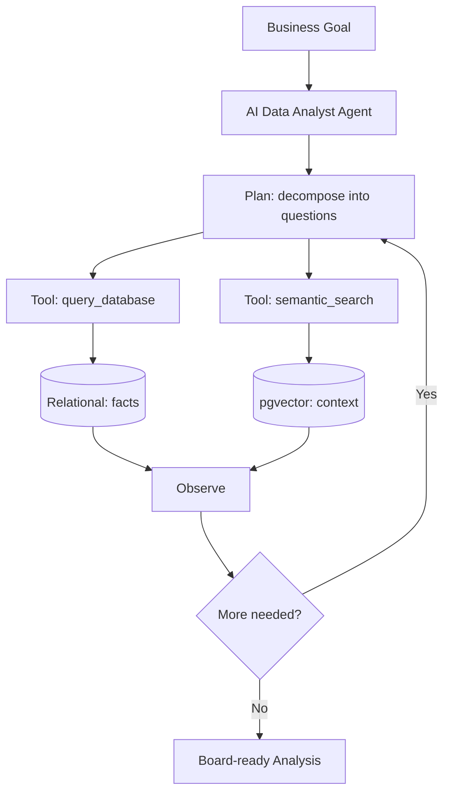

# 🏗️ PROJECT 08 — Agentic AI Data Analyst

> **Level:** L8 (AI & Agentic Systems Builder) — THE CAPSTONE
> **Skills:** Everything — RAG · pgvector · Read-only agents · Knowledge graphs · Multi-step reasoning
> **Datasets:** All DataVerse tables + embeddings

---

## 📋 The Brief

> **From:** Angela Davis (Chief Data Officer)
>
> *"This is the summit. Build an autonomous AI Data Analyst — an agent that can take a business goal like 'Find our biggest revenue risks this quarter', plan a series of SQL queries, execute them safely, retrieve supporting context with RAG, and produce a board-ready analysis. Show me the complete data architecture that makes an AI agent think with our data."*

---

## 🎯 What You'll Build

A complete agentic data layer: structured data + vector store + secure tools + reasoning loop.



---

## 🛠️ Deliverables

### 1. Vector Store (pgvector)

```sql
CREATE EXTENSION IF NOT EXISTS vector;

CREATE TABLE knowledge_embeddings (
    doc_id       SERIAL PRIMARY KEY,
    content      TEXT NOT NULL,
    source_table VARCHAR(50),
    source_id    INTEGER,
    category     VARCHAR(50),
    embedding    vector(1536)
);
CREATE INDEX ON knowledge_embeddings USING ivfflat (embedding vector_cosine_ops);
```

### 2. Agent Tools (secure, read-only)

```sql
-- Tool security: agent runs as read-only role
CREATE ROLE ai_analyst_readonly;
GRANT USAGE ON SCHEMA public TO ai_analyst_readonly;
GRANT SELECT ON ALL TABLES IN SCHEMA public TO ai_analyst_readonly;
ALTER ROLE ai_analyst_readonly SET statement_timeout = '15s';
```

```python
# The agent's two tools — both ultimately SQL
def query_database(sql: str) -> list:
    """Run a read-only SQL query against DataVerse."""
    assert sql.strip().upper().startswith("SELECT")
    return execute_as_role(sql, "ai_analyst_readonly")

def semantic_search(query_embedding: list, k: int = 5) -> list:
    """Retrieve the k most relevant context chunks."""
    return execute_as_role(f"""
        SELECT content, category
        FROM knowledge_embeddings
        ORDER BY embedding <=> '{query_embedding}'::vector
        LIMIT {k}
    """, "ai_analyst_readonly")
```

### 3. The Reasoning Loop (worked example)

**Goal:** *"Find our biggest revenue risks this quarter."*

The agent decomposes this into a sequence of SQL queries:

```sql
-- Step 1: Identify high-value customers at churn risk
SELECT c.company_name, c.lifetime_value, c.last_activity_date,
       CURRENT_DATE - c.last_activity_date AS days_inactive
FROM customers c
WHERE c.customer_status = 'Active'
  AND c.lifetime_value > 50000
  AND c.last_activity_date < CURRENT_DATE - INTERVAL '60 days'
ORDER BY c.lifetime_value DESC;

-- Step 2: Quantify revenue concentration (over-reliance on few customers)
WITH cust_rev AS (
    SELECT o.customer_id, SUM(st.revenue) AS rev
    FROM orders o JOIN sales_transactions st ON o.order_id = st.order_id
    GROUP BY o.customer_id
)
SELECT 
    ROUND(100.0 * SUM(rev) FILTER (WHERE rnk <= 5) / SUM(rev), 1) AS top5_revenue_pct
FROM (SELECT rev, RANK() OVER (ORDER BY rev DESC) AS rnk FROM cust_rev) x;

-- Step 3: Declining product lines
SELECT p.product_name,
       SUM(st.revenue) FILTER (WHERE st.fiscal_quarter = 3) AS q3,
       SUM(st.revenue) FILTER (WHERE st.fiscal_quarter = 4) AS q4
FROM sales_transactions st JOIN products p ON st.product_id = p.product_id
WHERE st.fiscal_year = 2024
GROUP BY p.product_name
HAVING SUM(st.revenue) FILTER (WHERE st.fiscal_quarter=4) 
     < SUM(st.revenue) FILTER (WHERE st.fiscal_quarter=3);
```

### 4. The Agent's Synthesized Output

> **AI Data Analyst — Revenue Risk Analysis (Q4 2024)**
>
> *Identified 3 key risks:*
> 1. **Churn risk:** 4 high-value customers (>$50K LTV) inactive 60+ days — $XXX at risk.
> 2. **Concentration:** Top 5 customers = XX% of revenue — dangerous dependency.
> 3. **Declining products:** N product lines fell QoQ.
>
> *Recommended actions: [retrieved via RAG from playbook docs]...*

### 5. Knowledge Graph (for relationship reasoning)

```sql
CREATE TABLE kg_nodes (node_id SERIAL PRIMARY KEY, node_type VARCHAR(50), name VARCHAR(200));
CREATE TABLE kg_edges (edge_id SERIAL PRIMARY KEY, from_node INT, to_node INT, relationship VARCHAR(50));

-- Agent traverses: which reps own the at-risk accounts?
WITH RECURSIVE account_chain AS (
    SELECT from_node, to_node FROM kg_edges WHERE relationship = 'MANAGES_ACCOUNT'
)
SELECT n1.name AS rep, n2.name AS account
FROM account_chain ac
JOIN kg_nodes n1 ON ac.from_node = n1.node_id
JOIN kg_nodes n2 ON ac.to_node = n2.node_id;
```

---

## 🏁 Acceptance Criteria

- [ ] pgvector embeddings table + index created
- [ ] Read-only agent role with timeout
- [ ] Two tools defined (query_database, semantic_search)
- [ ] Multi-step reasoning chain (3+ SQL queries) for a real goal
- [ ] Synthesized board-ready output
- [ ] Knowledge graph traversal included

---

## 🚀 Stretch Goals

1. Add prompt-injection detection on retrieved context.
2. Build a query result cache to reduce DB load.
3. Add a "confidence" score based on data completeness.
4. Chain RAG + SQL into a single grounded answer.

---

## ⚠️ Security Notes

- Agents run **read-only** with statement timeouts.
- Validate every generated query (SELECT-only allowlist).
- Treat retrieved documents as untrusted (prompt-injection risk).
- Audit-log every tool call.

---

## 📦 Portfolio Presentation — THE CENTERPIECE

This is your flagship portfolio project. Include:
- `agentic_analyst.sql` (vector store, roles, KG)
- An architecture diagram (relational + vector + agent loop)
- A demo transcript: goal → agent's queries → final analysis
- A writeup: *"How SQL is the foundation of AI agents"*
- This single project demonstrates the entire journey: SELECT → warehouse → AI.

---

## 🎓 Congratulations

If you've built all 8 projects, you have a portfolio that proves you are a **Data Architect & AI Professional**. Ship it on GitHub. Write the blogs. Get the job.
