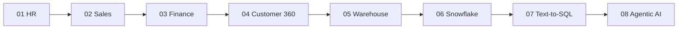

# 🏗️ PROJECTS — Build Your Portfolio

These 8 capstone projects turn your SQL skills into portfolio pieces that get you hired. Each uses the DataVerse Inc. datasets and maps to a career level.

| # | Project | Level | Skills | What it proves |
|---|---------|-------|--------|----------------|
| 01 | [HR Analytics Platform](PROJECT-01/README.md) | L2-L3 | Views, aggregations, windows | You can build BI layers |
| 02 | [Sales Intelligence Platform](PROJECT-02/README.md) | L2-L3 | Joins, windows, segmentation | You can drive revenue analytics |
| 03 | [Finance Analytics Platform](PROJECT-03/README.md) | L2-L3 | Variance, GENERATED cols | You can do financial reporting |
| 04 | [Customer 360](PROJECT-04/README.md) | L3-L4 | Denormalization, CTEs | You can unify data sources |
| 05 | [Data Warehouse Design](PROJECT-05/README.md) | L7 | Star schema, SCD2, ETL | You can architect a warehouse |
| 06 | [Postgres → Snowflake Migration](PROJECT-06/README.md) | L6 | Streams, Tasks, Time Travel | You know cloud DW |
| 07 | [Text-to-SQL AI Assistant](PROJECT-07/README.md) | L8 | Schema context, security | You can build AI data layers |
| 08 | [Agentic AI Data Analyst](PROJECT-08/README.md) | L8 | RAG, pgvector, agents | You're an AI data professional |

---

## 🎯 How to Use These

1. **Pick projects at your level** — don't jump to Project 08 on day one.
2. **Build them for real** — run the SQL against your DataVerse database.
3. **Document everything** — each project has a "Portfolio Presentation" section.
4. **Push to GitHub** — a clean repo per project (or one mono-repo).
5. **Write about it** — turn each into a blog and a LinkedIn post (see [BLOGS/](../BLOGS/) and [LINKEDIN_POSTS/](../LINKEDIN_POSTS/)).

---

## 🏆 Recommended Portfolio Path

Complete all 8 and you have a portfolio spanning **analyst → engineer → architect → AI professional**.
